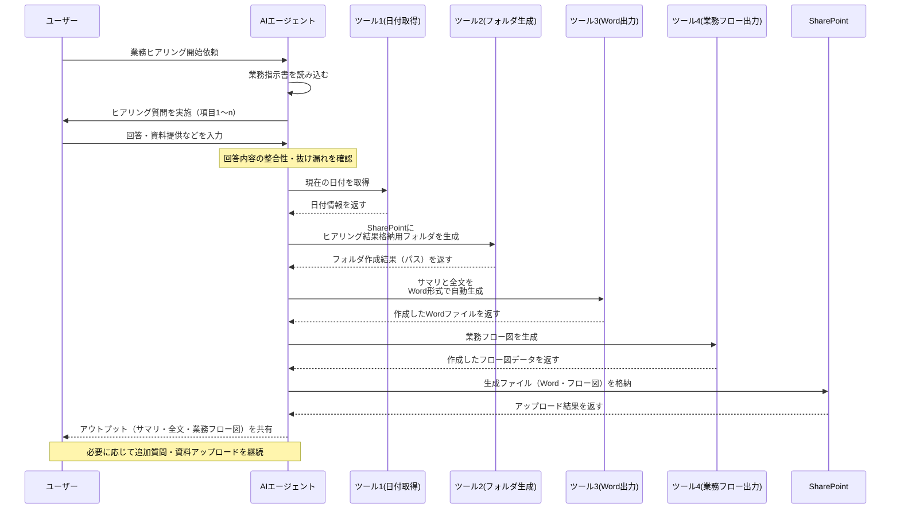

## AIエージェントによる業務ヒアリングの自動化について

[https://qiita.com/jw-automation/items/7dd88bb70e0d25e7b06b](https://qiita.com/jw-automation/items/7dd88bb70e0d25e7b06b)

この記事は、AIエージェントを活用した業務ヒアリングの自動化について解説しています。

### はじめに

2023年から2024年にかけてChatGPTをはじめとする生成AIが急速に普及し、企業では試験的な導入から具体的な業務への適用へとフェーズが移行しています。特に、RAG（Retrieval-Augmented Generation）を用いた社内情報への問い合わせなどが普及していますが、今後は業務プロセス自動化の文脈で、よりエージェント的な活用が増加すると予想されています。RPA（ロボティック・プロセス・オートメーション）が定型業務に限定されていたのに対し、LLM（大規模言語モデル）は思考・言語能力を持つため、デジタルレイバー（仮想労働者）の本格的な活用が期待されています。この記事では、コンサルティングファームが長年課題としてきた「業務ヒアリング」のAIエージェントによる自動化について検討します。

### 業務ヒアリング自動化の背景

DX（デジタルトランスフォーメーション）プロジェクト、特に業務BPR（ビジネスプロセス・リエンジニアリング）や自動化プロジェクトにおいて、現状把握（AsIs把握）は不可欠です。現状が不明確なままでは、課題の整理、ToBe（あるべき姿）の検討、ギャップ分析などが進められません。業務効率化や刷新のためには、現状の正確な把握が前提となります。多くの企業では、業務プロセスが十分に可視化・管理されておらず、現場担当者レベルでしか詳細が把握されていないケースが少なくありません。そのため、DX・自動化プロジェクトは、泥臭い業務ヒアリングから始まることが常です。

業務ヒアリングは、現状把握という付加価値を生まないプロセスでありながら、ToBeの検討・実装という本質的な価値創造プロセスに多くの時間を割くために、極力省力化・自動化が求められます。

### 各関係者の立場

業務ヒアリングに対する各関係者の立場は以下の通りです。

**①企業側（プロジェクト管理者）**

企業側は、付加価値のない現状把握プロセスのコスト削減を望んでいます。しかし、現場担当者は日常業務に追われ、現状整理のノウハウも不足している場合が多く、成果物の品質もばらつきがちです。そのため、現状把握をコンサルティングファームに依頼することが多いですが、コストの高さが課題となります。

**②コンサルティングファーム側**

コンサルティングファームにとって、業務ヒアリングは「最もおいしい案件」です。人月単位で売上を上げるビジネスモデルのため、多くの人員を投入できる業務ヒアリングは、未経験の若手や中途採用者を稼働させるのに適しています。専門性が高くなくても人手が必要なため、経験豊富なPM（プロジェクトマネージャー）の下に多数のメンバーを配置するプロジェクト構成が可能です。企業側はコストに不満を感じつつも、他に手段がないため依頼を続けるという状況が続いています。

**③ビジネスアナリスト側**

ビジネスアナリスト（プロジェクトPM担当者）にとって、業務ヒアリングは「非常に面倒」な業務です。彼らの本領は業務分析や示唆出しにあり、現状可視化はクライアント側で済ませてほしいと考えています。しかし、実際にはゼロからヒアリング全体を管理し、若手メンバーの指導・マネジメントに追われることが多く、個人のキャリア形成という面では魅力に欠ける案件と捉えがちです。

**④ソリューションアーキテクト側**

ソリューションアーキテクトは、ToBe検討の要であり、「勝手に業務ヒアリングを進めないでほしい」と考えています。業務コンサルタントであるビジネスアナリストは、ITに関する知識が不足している場合があり、ヒアリング結果にシステム関連の情報が欠落していることがあります。そのため、手戻りや誤った期待値につながるリスクがあり、ヒアリング初期段階からの参加が理想的です。ただし、全てのヒアリングに参加するのではなく、必要な情報が可視化され、ToBe検討にスムーズに入れる状態が望ましいと考えています。

このように、現状把握である業務ヒアリングは、アナログで工数がかかる割に付加価値が低いため、関係者全員が省力化を望んでいます。

### AIエージェントによる業務ヒアリングのメリット

AIエージェントによる業務ヒアリング自動化には、以下の3つのメリットがあります。

**①エキスパートの知見の再利用**

経験豊富なビジネスアナリストの知識やノウハウをAIに学習させることで、そのスキルをプロジェクト全体で再利用できます。ビジネスアナリストだけでなく、ソリューションアーキテクトや企業側のPMの視点もAIに組み込むことで、多角的な視点でのヒアリングが可能になります。エキスパートの知識をいつでも再利用できるため、全ての業務ヒアリングを高度な視点で実施できます。

**②品質の標準化とスキルの蓄積**

AIエージェントは、ヒアリング品質を標準化できます。人間が行う場合、聞き忘れや視点の偏りが生じやすいですが、AIエージェントは抜け漏れがなく、常に一定の品質を保ちます。特に大規模な業務ヒアリングにおいて、品質の均一化は大きなメリットです。また、AIエージェントはスキルを蓄積し、再現性が高いため、PDCAサイクルを回してスキルを向上させることも可能です。異動などで担当者が変わっても、過去の知見が蓄積されたAIエージェントは、新しい担当者にとって強力なサポートとなります。

**③人的コストの削減**

AIエージェントは、人件費を大幅に削減できます。現状把握の業務ヒアリング要員が不要になるだけでなく、エキスパートもマネジメント業務から解放され、より高度な業務に集中できます。また、ビジネスアナリスト、ソリューションアーキテクト、企業側PMの視点が標準化されることで、関係者間の報告・コミュニケーションコストも削減できます。さらに、ヒアリングの日程調整が不要になり、並行実行が可能になるため、大幅な効率化が期待できます。例えば、人手では1ヶ月かかる100件のヒアリングも、AIエージェントなら担当者の都合がつけば1日で完了することも可能です。

### AIエージェントの実装

**AIエージェントへのインプット**

AIエージェントの動作を定義する業務指示書（指示プロンプト）をAIに読み込ませます。これは、優秀な人材に指示を与えるイメージに近く、ヒアリング内容の変更も業務指示書を修正するだけで対応できます。SharePointなどに業務指示書を配置し、AIエージェントがアクセスできるようにします。

業務指示書の構成要素は以下の通りです。

1.  役割の提示
2.  前提条件の指定
3.  ヒアリング全体の流れの指示
4.  各ヒアリングステップの詳細
5.  ヒアリング項目の一覧
6.  ヒアリング後のユーザーへの依頼事項
7.  アウトプット生成の指示
8.  よくある質問一覧
9.  社内用語一覧

**AIエージェントのアウトプット**

ヒアリングのアウトプットとして、「①ヒアリングのサマリ」「②ヒアリングの全文」「③簡易業務フロー図」を出力します。各ヒアリングごとにフォルダを自動生成し、アウトプットを格納します。アウトプット形式はプロジェクトの成果物に合わせて変更可能です（PowerPoint形式、SharePointリストへの書き込みなど）。

**AIエージェントのツール**

AIエージェントには、以下のツールを定義します。

*   **【ツール1】日付取得**: 当日の日付を取得し、フォルダ名やファイル名に使用。
*   **【ツール2】フォルダ生成**: SharePoint上に任意のフォルダを作成し、アウトプット格納フォルダとして利用。
*   **【ツール3】Word出力**: テキスト情報をWord形式で出力し、SharePointに格納（サマリ、全文出力に使用）。
*   **【ツール4】業務フロー出力**: 簡易的な業務フロー図を描画し、SharePointに格納（業務の流れの可視化に使用）。

これらのツールにより、AIエージェントは必要なタイミングでアウトプットを生成し、SharePointへの格納を自動で行います。

### 業務フロー図

### AIエージェントによる業務ヒアリングデモ

LangChainで実装したAIエージェントをFlaskのチャットアプリに組み込み、Azure Web Appsとしてデプロイしました。ブラウザからアクセスすると、業務指示書に従ってAIエージェントが自動で業務ヒアリングを進めます。ヒアリング完了後、ツールを用いてSharePoint上にフォルダを作成し、指定されたアウトプットを格納します。

**SharePoint上に生成されたフォルダとアウトプットファイル**

*   ヒアリング結果フォルダ
*   ヒアリング結果フォルダ内（サマリ、全文、業務フロー図、受領資料フォルダ）
*   ヒアリング結果サマリ（Wordファイル抜粋）
*   ヒアリング結果全文（Wordファイル抜粋）
*   簡易業務フロー（自動生成）
*   受領資料フォルダ（ユーザーが資料を格納）

フローチャートはスイムレーン形式ですが、BPMNやMermaidなどの標準記法、PowerPoint形式での出力も可能です。AIエージェントは、対面ではデリケートな話題や期待値コントロールが必要な事項も伝えやすいという利点があります。実装のポイントは、汎用性と確実性のバランスであり、プログラムで固める部分とプロンプトで制御する部分の設計が重要です。

### 今後のアップデート

今後のアップデートとして、以下が検討されています。

*   **ファイル格納チェック**: ユーザーが参考ファイルの格納を忘れた場合に督促し、格納されたら管理者に通知する機能を追加。監視エージェントを作成し、業務ヒアリングエージェントと連携させることを検討。
*   **ToBe検討**: AsIs把握だけでなく、次のステップであるToBe検討もAIエージェントで代替することを目指す。業務見直しのBPR視点や、自動化ソリューションの特性を学習させ、ToBeの素案を提示できるようにする。

### 応用先

AIエージェントの応用範囲は広く、業務ヒアリング以外にも「ユーザーとやり取りしながら必要なアウトプットを作成する」という点で様々な業務に適用可能です。例えば、プロジェクト計画書、RFP（Request for Proposal）、提案書などの作成支援、申請プロセス自動化などが考えられます。AIエージェントを活用することで、ユーザーは専門家（AI）のサポートを受けながら、効率的にアウトプットを作成できます。

### まとめ

AIエージェントによる業務ヒアリングの自動化は、業務効率化、品質向上、コスト削減に大きく貢献する可能性を秘めています。今後は、AsIsヒアリングだけでなく、ToBe検討の自動化も視野に入れ、AIエージェントの活用範囲を広げていくことが期待されます。RAGによる問い合わせ検索から、次のフェーズへの移行を検討する上で、この記事が参考になれば幸いです.

### （補足）プロセスマイニング・タスクマイニングについて

業務ヒアリングの自動化に関連して、プロセスマイニング・タスクマイニングについても触れておきます。プロセスマイニング・タスクマイニングは、業務プロセス可視化の自動化を目的として注目されましたが、現状ではフィジビリティが低いと言わざるを得ません。

**プロセスマイニング**

プロセスマイニングは、システムログに基づいて業務プロセスを可視化しますが、複数のシステム・アプリにまたがる業務プロセスや、アナログな作業を含むプロセス全体を可視化するのは困難です。システムごとにログの形式や粒度が異なり、SaaS型ツールではログが取得できない場合もあります。SAPなどの基幹システムに限定するなど、ログが取得できる範囲を絞った活用が現実的です。

**タスクマイニング**

タスクマイニングは、ユーザーのPC操作ログに基づいて業務量を調査しますが、人の意思決定までは把握できません。業務プロセス可視化という観点では、ノイズが多く、精度が不十分です。業務量調査や、どのシステムをどの程度利用しているかの全体像を把握する用途には有用です。

プロセスマイニング・タスクマイニングは、業務プロセス可視化の全自動化という当初の期待には応えられていないのが現状です。しかし、完全デジタル化・自動化された後の業務管理・可視化には、生成AIが有効である可能性があります。自動化されたシステムやRPA、BI、AIなどのプログラムを生成AIに読み込ませることで、システムが何をしているかを可視化できるかもしれません。ただし、これは完全自動化後の話であり、本格的な実現にはまだ時間がかかると考えられます。

プロセスマイニング・タスクマイニングは、コンセプトは優れていますが、安易な期待は禁物です。用途を限定すれば有用ですが、業務プロセス可視化の全自動化は容易ではないことを理解しておく必要があります.

---

ファイルは `D:\BMS\document\tech_docs\AI_Agent_for_Business_Hearing_Automation.md` に保存しました。

ご確認ください.