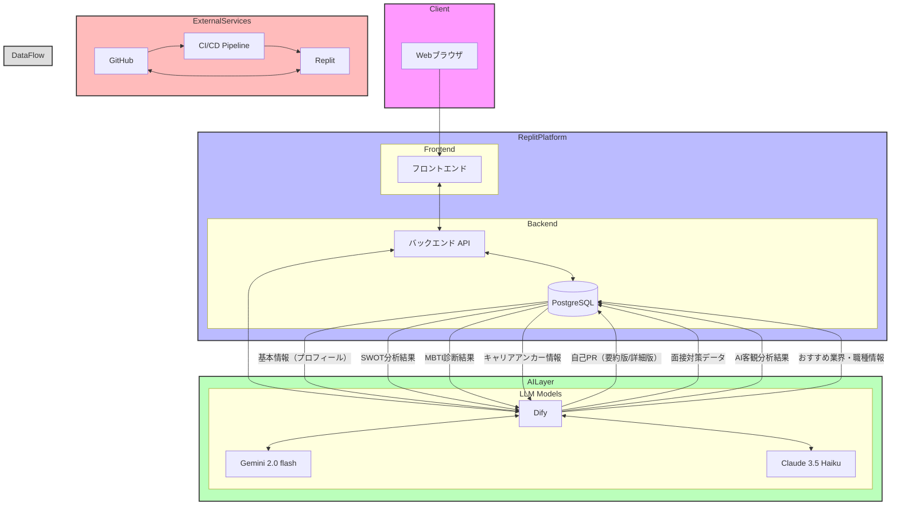

## アーキテクチャ説明

### クライアント層
- **Webブラウザ**: ユーザーインターフェースを提供し、ユーザーの入力を受け付け

### Replitプラットフォーム
- **フロントエンド**: ユーザー情報入力、自己分析機能、結果表示などのUI実装
- **バックエンド**: APIエンドポイントの提供、ビジネスロジックの実装
- **PostgreSQL**: ユーザー情報、分析結果などのデータを永続化

### AI層
- **Dify**: AIワークフローの管理、プロンプト設計、対話フローの構築
- **LLMモデル**:
  - Gemini 2.0 flash: データ整理・要約処理
  - Claude 3.5 Haiku: 自然な日本語での対話応答

### 外部サービス
- **GitHub**: ソースコード管理
- **CI/CD**: 自動デプロイパイプライン

### データフロー
1. 入力データ（DB → Dify）
   - 基本情報（プロフィール）：学歴、キャリア情報、志望業種など
   - SWOT分析結果：強み、弱み、機会、脅威の分析データ
   - MBTI診断結果：性格特性の診断情報
   - キャリアアンカー情報：価値観や動機に関する深堀りデータ

2. 分析・生成データ（Dify → DB）
   - 自己PR：履歴書用の要約版（500字程度）と面接対策用の詳細版
   - 面接対策データ：想定質問と模範回答
   - AI客観分析結果：ユーザーの特性や適性の分析
   - おすすめ業界・職種情報：ユーザーの特性に合わせた提案

### AIモデルの使い分け
- **Gemini 2.0 flash**
   - SWOT分析やMBTI診断結果の整理・要約
   - 大量のプロフィールデータの構造化
   - 自己PR要約版の生成

- **Claude 3.5 Haiku**
   - ユーザーとの自然な対話による情報収集
   - キャリアアンカーに関する深堀り質問
   - 面接対策での自然な日本語での回答生成

このアーキテクチャにより、効率的な開発運用と高品質な自己分析支援を実現し、ユーザーの就職活動を効果的にサポートしています。
