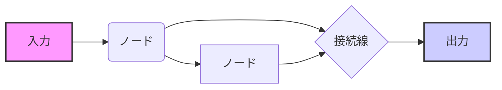

# Dify 実践ハンズオン

## 1. はじめに

### 1.1 目的
このハンズオンでは、Difyを業務で効果的に活用するための基本的な知識と実践的なスキルを習得することを目的とします。Difyの基本的な使い方から、ワークフローの作成、高度な活用方法、トラブルシューティング、セキュリティ対策までを網羅的に学び、業務効率化、生産性向上、リスク低減に繋げることを目指します。Difyを活用することで、日々の業務における課題を解決し、より効率的で質の高い業務遂行を目指します。

### 1.2 対象者
このハンズオンは、以下の方を対象としています。
- 生成AIの業務活用に関心のある方
- Difyの業務活用を検討している方
- Difyの基本操作を学びたい方

### 1.3 前提知識
このハンズオンでは、以下の知識があることが望ましいです。
- 生成AIの基礎知識：LLMやプロンプトの基本概念の理解。
- プロンプトエンジニアリングの基礎知識：指示の明確化、制約条件設定など。
- 基本的なPC操作スキル：ファイル操作、Webブラウジングなど。

## 2. Difyの基本

### 2.1 Difyとは
Difyは、AIアプリケーションの開発を支援するオープンソースプラットフォームです。

特に「チャットフロー」と「テキストジェネレーター」の2つの主要な機能を提供しており、ユーザーは対話型アプリケーションや高品質なテキスト生成アプリケーションを容易に作成できます。

Difyは、ノーコードでLLM（大規模言語モデル）アプリケーションを開発・運用できるプラットフォームであり、ChatGPTのような生成AIとのやり取りを「ワークフロー」として定義し、繰り返し利用できる点が最大の特徴です。これにより、複雑な業務プロセスを効率的に実行し、高品質な成果物を安定的に生成できます。Difyは、AI技術をより身近にし、業務効率化を支援する強力なツールです。

#### 2.1.1 Difyの主な機能
Difyには、以下のような主要な機能があります。
- **ワークフロー作成**：
  - **プロンプトのテンプレート化と再利用**：
    - プロンプトをテンプレートとして保存し、変数や条件分岐を組み込むことで、柔軟なワークフローを作成できます。
    - これにより、同じような処理を何度も繰り返す手間を省き、効率的な業務遂行を支援します。
  - **複数ステップ処理の自動化**：
    - 複数の処理を組み合わせて、複雑なワークフローを自動化できます。
    - これにより、手作業では時間がかかる処理も、Difyを使えば効率的に実行できます。
  - **外部ツールとの連携**：
    - API、データベース、ファイルシステムなど、外部ツールとの連携が可能です。
    - これにより、Difyを他のシステムと連携させ、より高度な業務プロセスを自動化できます。
  - **条件分岐とループ処理の実装**：
    - if-else, for, whileなどの条件分岐やループ処理を実装できます。
    - これにより、複雑な条件に応じた処理や、繰り返し処理を自動化できます。
  - **エラーハンドリングの実装**：
    - try-catch, retryなどのエラーハンドリングを実装できます。
    - これにより、エラーが発生した場合でも、ワークフローが停止することなく、安定的に処理を継続できます。
- **アプリケーション公開**：
  - **Webアプリケーションとしての公開**：
    - 作成したワークフローをWebアプリケーションとして公開し、URLを共有することで、チーム内での利用や外部公開が可能です。
    - これにより、Difyで作成したアプリケーションを、他のユーザーも簡単に利用できます。
  - **チーム内共有と外部公開**：
    - アクセス権限を設定することで、チーム内での共有や外部公開を柔軟に行えます。
    - これにより、Difyで作成したアプリケーションを、必要なユーザーのみに公開できます。
  - **APIエンドポイントの提供**：
    - REST API, GraphQL APIなどのAPIエンドポイントを提供します。
    - これにより、Difyで作成したアプリケーションを、他のシステムからAPI経由で利用できます。
  - **カスタムドメインの設定**：
    - カスタムドメインを設定することで、Difyで作成したアプリケーションを、独自のドメインで公開できます。
    - これにより、ブランドイメージを向上させることができます。
- **豊富なテンプレート**：
  - **多様なユースケースに対応**：
    - 業務効率化、コンテンツ生成、データ分析など、様々なユースケースに対応したテンプレートを提供しています。
    - これにより、初心者でも簡単にDifyを使い始めることができます。
  - **初心者向け利用開始の容易さ**：
    - チュートリアルやサンプルデータを提供しており、初心者でも簡単にDifyを使い始めることができます。
    - これにより、Difyの学習コストを削減できます。
  - **テンプレートのカスタマイズ**：
    - プロンプト、設定、UI/UXなど、テンプレートを自由にカスタマイズできます。
    - これにより、テンプレートを自社の業務に合わせて最適化できます。
  - **テンプレートの共有機能**：
    - 作成したテンプレートを共有できます。
    - これにより、チーム内でテンプレートを共有し、効率的な業務遂行を支援できます。
- **カスタマイズ性**：
  - **プロンプトと設定の自由なカスタマイズ**：
    - 変数、関数、条件式など、プロンプトや設定を自由にカスタマイズできます。
    - これにより、Difyを自社の業務に合わせて柔軟にカスタマイズできます。
  - **独自のワークフロー構築**：
    - カスタムノード、カスタムツールなど、独自のワークフローを構築できます。
    - これにより、Difyの機能を拡張し、より高度な業務プロセスを自動化できます。
  - **UI/UXのカスタマイズ**：
    - テーマ、レイアウト、コンポーネントなど、UI/UXを自由にカスタマイズできます。
    - これにより、Difyを自社のブランドイメージに合わせてカスタマイズできます。
  - **多言語対応**：
    - 多言語に対応しており、グローバルな業務にも対応できます。
    - これにより、Difyを世界中のユーザーが利用できます。

### 2.2 Difyのメリット
Difyを活用することで、以下のようなメリットが得られます。
- **業務効率化**：
  - **繰り返し作業の自動化**：
    - 定型業務やルーチンワークを自動化することで、手作業による時間や手間を削減できます。
    - これにより、従業員はより創造的な業務に集中できます。
  - **プロンプト入力の効率化**：
    - テンプレートや変数を利用することで、プロンプト入力の手間を削減できます。
    - これにより、プロンプト作成にかかる時間を短縮できます。
  - **人的ミスの削減**：
    - 自動化により、手作業による人的ミスを削減できます。
    - これにより、業務の品質を向上させることができます。
  - **処理時間の短縮**：
    - 並列処理や非同期処理を利用することで、処理時間を短縮できます。
    - これにより、業務のスピードを向上させることができます。
  - **リソースの最適化**：
    - Difyを活用することで、人的リソースを最適化できます。
    - これにより、より効率的な業務遂行が可能になります。
- **品質向上**：
  - **出力品質の安定化**：
    - プロンプトを固定化し、パラメータを設定することで、毎回同じ品質の出力を実現できます。
    - これにより、出力結果のバラつきを解消できます。
  - **プロンプトの安定化**：
    - バージョン管理やテスト機能を利用することで、プロンプトのバラつきを解消できます。
    - これにより、出力結果の安定性を向上させることができます。
  - **複雑な処理の正確な実行**：
    - 条件分岐やループ処理を利用することで、複雑な処理も正確に実行できます。
    - これにより、複雑な業務プロセスも自動化できます。
  - **エラーハンドリングの実装**：
    - try-catch, retryなどのエラーハンドリングを実装することで、エラーが発生した場合でも、ワークフローが停止することなく、安定的に処理を継続できます。
  - **出力結果の検証**：
    - 出力結果を検証する機能を利用することで、出力結果の品質を向上させることができます。
    - これにより、より信頼性の高い出力結果を得ることができます。
- **開発コスト削減**：
  - **ノーコード開発**：
    - GUIベースの開発環境を提供しており、プログラミングスキルがなくてもLLMアプリケーションを開発できます。
    - これにより、開発にかかるコストを削減できます。
  - **プログラミングスキル不要**：
    - ドラッグ＆ドロップや設定画面を利用することで、プログラミングスキルがなくても簡単にアプリケーションを開発できます。
    - これにより、開発のハードルを下げることができます。
  - **開発期間の短縮**：
    - テンプレートや再利用可能なコンポーネントを利用することで、開発期間を短縮できます。
    - これにより、迅速なアプリケーション開発が可能になります。
  - **メンテナンスコストの削減**：
    - 自動デプロイやバージョン管理を利用することで、メンテナンスコストを削減できます。
    - これにより、アプリケーションの運用コストを削減できます。
  - **学習コストの削減**：
    - Difyの操作は直感的で、学習コストを削減できます。
    - これにより、Difyを導入する際のハードルを下げることができます。

### 2.3 Difyの基本操作

Difyを利用するための基本的な操作は以下の通りです。

- **アカウント作成**：
  - Dify公式サイトからアカウントを作成します。
    - メールアドレスやGoogleアカウントなどを利用して登録できます。
    - 無料プランでも利用可能ですが、機能制限があります。
    - 企業向けプランも用意されており、料金体系やサポート内容を確認できます。
    - チームアカウントを作成することで、複数人でDifyを利用できます。
- **ログイン**：
  - 作成したアカウントでDifyにログインします。
    - メールアドレスとパスワードを入力します。
    - セキュリティ強化のため、2段階認証を設定することを推奨します。
    - パスワードを忘れた場合は、パスワードリセット機能を利用できます。
- **アプリケーション作成**：
  - Difyにログイン後、「最初から作成」をクリックして、新規アプリケーションを作成します。
    - アプリケーション名を入力します。プロジェクト名やサービス名など、わかりやすい名前を設定します。
    - アプリケーションの種類を選択します。「チャットフロー」または「テキストジェネレーター」を選択できます。
    - アプリケーションの説明を入力します。アプリケーションの目的や概要などを記述します。
    - アプリケーションのアイコンを設定します。
- **ワークフロー作成**：
  - LLMノードを追加します。
    - LLMノードは、プロンプトを実行するためのノードです。
    - プロンプトを入力します。指示文や変数などを記述します。
  - 必要に応じて、他のノードを追加します。
    - ツールノード、コードノード、条件分岐ノード、ループノードなどを追加できます。
  - ノードを接続し、データの流れを設定します。
    - ノード間の接続線をクリックして、データの流れを設定します。
  - 各ノードの設定を行います。
    - ノードをクリックして、パラメータを設定します。
  - ノードの複製や削除を行います。
    - ノードを右クリックして、複製や削除を選択します。
- **プレビュー**：
  - 右上の「プレビュー」ボタンをクリックして、ワークフローを実行します。
    - 動作確認を行います。入力値を変更したり、出力結果を確認したりできます。
    - デバッグ機能を利用します。ログを確認したり、エラーを特定したりできます。
    - ステップ実行を利用して、ワークフローをステップごとに実行できます。
- **公開**：
  - 「公開」ボタンをクリックして、アプリケーションを公開します。
    - URLを共有して、Webアプリケーションとして利用できます。
    - APIエンドポイントを確認して、APIとして利用できます。
    - アクセス権限を設定して、公開範囲やユーザー権限を設定できます。
    - バージョン管理を利用して、アプリケーションのバージョンを管理できます。

### 2.4 ワークフローの構成要素
ワークフローは、以下の要素で構成されます。

- **入力**：
    - ワークフローの開始時に与えるデータです。ユーザーからの入力や外部データなどが入力として利用できます。
    - データ形式：テキスト、ファイル、APIレスポンスなど、様々なデータ形式を入力として利用できます。
  - **ノード**：
    - ワークフローの処理単位です。Difyには、様々な種類のノードがあります。
  - **接続線**：
    - ノード間のデータの流れを表します。ノードの出力と次のノードの入力を接続します。
  - **出力**：
      - ワークフローの結果：ワークフローの最終的な結果です。テキスト、ファイル、APIレスポンスなど、様々なデータ形式で出力できます。

### 2.5 ノードの詳細
Difyで利用できる主なノードは以下の通りです。
- **LLMノード**：
    - LLM（大規模言語モデル）を実行するノードです。プロンプトを入力し、テキストを生成します。
- **ツールノード**：
    - 外部ツールと連携するノードです。Web検索、データベースアクセス、API連携などを行うことができます。
- **コードノード**：
    - Pythonコードを実行するノードです。複雑な処理や独自の処理を実装できます。
- **条件分岐ノード**：
    - 条件によって処理を分岐するノードです。if-else文のように、条件によって異なる処理を実行できます。
- **ループノード**：
    - 同じ処理を繰り返すノードです。for文やwhile文のように、複数回同じ処理を実行できます。

## 3. ワークフロー作成

### 3.1 ワークフローとは
ワークフローとは、一連の作業手順を定義したものです。Difyでは、LLMとのやり取りをワークフローとして定義し、自動化することができます。これにより、複雑な業務プロセスを効率的に実行し、高品質な成果物を安定的に生成できます。ワークフローは、業務効率化の鍵となる重要な要素です。

### 3.2 チャットフロー
チャットフローは、ユーザーとの対話型アプリケーションを構築するための機能です。ドラッグ＆ドロップでノード（ブロック）をつなぎ、ユーザーの入力に応じてフローを変化させることで、インタラクティブな応答を提供できます。例えば、ユーザーが特定の質問を入力すると、その質問に応じて異なる処理や応答を行うことが可能です。

チャットフローの主な特徴には以下のものがあります：
- 直感的なUI: コード不要で、視覚的にフローを設計できます。
- 柔軟な情報抽出: パラメータ抽出機能により、会話から必要な情報を取得できます。
- インタラクティブな対応: 情報が不足している場合、追加の質問を行うことでユーザーとの対話を深められます。

これにより、カスタマーサービスや学習支援アプリケーションなど、複数のステップを含む論理的な対話シナリオに適しています。

### 3.3 テキストジェネレーター
テキストジェネレーターは、ユーザーが提供するプロンプトに基づいて高品質のテキストを自動生成するアプリケーションを構築するための機能です。記事の要約や翻訳など、さまざまなタイプのテキストを生成できます。

テキストジェネレーターの主な機能には以下のものがあります：
- 一度実行: クエリ内容を入力し、実行ボタンをクリックすると結果が生成されます。
- バッチ実行: 複数のプロンプトを一括で処理し、効率的にテキストを生成できます。
- 実行結果の保存: 生成された結果を保存し、後で参照できます。
- 類似結果の生成: 現在の結果と似た内容を追加で生成することが可能です。

これにより、ブログ記事の作成や論文の要約など、コンテンツ生成の効率化に役立ちます。

## 4. Difyの活用例

### 4.1 一般的な活用例
- テキスト生成（ブログ記事、メール、レポートなど）
- テキスト要約（記事、論文、会議議事録など）
- テキスト翻訳（多言語対応）
- 質疑応答（FAQ、カスタマーサポートなど）
- データ分析（データ抽出、データ変換など）
- レポート作成（レポートテンプレート、データなど）
- 顧客サポート（問い合わせ内容、回答など）
- 業務自動化

### 4.2 業務での活用例
- マーケティング
  - 顧客データの分析（顧客属性、購買履歴など）
  - 顧客管理システムの連携

- マーケティングキャンペーンの企画（キャンペーン内容、予算など）
  - マーケティングオートメーションツールとの連携

- エンジニアリング
  - APIドキュメントの生成（API仕様、エンドポイントなど）
  - CI/CDツールとの連携

- 人事
  - 採用候補者のスクリーニング（履歴書、職務経歴書など）
  - 人事管理システムの連携
- 営業
  - 営業資料の作成（提案書、見積書など）
  - CRMツールとの連携
- 経理
  - 経費精算の自動化（領収書、請求書など）
  - 会計システムとの連携

## 5. Difyの注意点

### 5.1 トークン数
- 入力と出力のトークン数に制限がある：LLMモデルには、入力と出力のトークン数に制限があります。モデルによって制限が異なるため、利用するモデルのトークン数制限を確認する必要があります。
- 長文を扱う場合は注意が必要：長文を扱う場合は、トークン数の上限に注意する必要があります。トークン数を超えると、エラーが発生したり、出力結果が途中で途切れたりする可能性があります。
- トークン数を意識したプロンプト設計：トークン数を削減するために、プロンプトを工夫する必要があります。不要な情報を削除したり、テキストを要約したりすることで、トークン数を削減できます。
- トークン数の見積もり：トークン数を事前に見積もることで、トークン数制限を超えないようにすることができます。Difyには、トークン数を計算する機能があります。
- トークン数の削減方法：テキストの圧縮、要約など、トークン数を削減する方法を検討する必要があります。
- トークン数の監視：トークン数を監視することで、トークン数制限を超えないようにすることができます。

### 5.2 費用
- プランにより費用が発生する場合がある（無料プランには機能制限あり）。
- 利用モデルによって費用が異なるため、料金体系を確認する。
- コストパフォーマンスを考慮したモデル選択が重要。
- 費用対効果を分析し、予算内で利用する。
- 利用費用の監視を行う。

### 5.3 セキュリティ
- 機密情報を取り扱う際はセキュリティに注意する。
- 外部公開時はアクセス制限や認証などの対策が必要。
- アクセス権限設定、データ暗号化でセキュリティを強化する。
- セキュリティポリシーを遵守し、定期的な監査を行う。

### 5.4 トラブルシューティング
- エラーメッセージとログを確認し、原因を特定する。
- プロンプトやノード設定を見直す。
- Difyのドキュメントを参照し、解決策を探す。
- サポートへの問い合わせやコミュニティでの情報交換も有効。
- 過去の事例を参考に解決策を探す。

## 6. まとめ

### 6.1 Difyのメリット
- ノーコードでLLMアプリケーションを開発：プログラミングスキルがなくても、GUIベースの開発環境でLLMアプリケーションを開発できます。
- 業務効率化と品質向上：自動化により、業務効率を向上させ、高品質な出力結果を得ることができます。
- 開発コスト削減：開発期間を短縮し、メンテナンスコストを削減できます。
- 柔軟なカスタマイズ：独自のワークフローやUI/UXをカスタマイズできます。
- チームでの共有：コラボレーション機能やアクセス権限を利用して、チームでDifyを利用できます。
- 最新技術の活用：最新のAI技術を活用し、業務を効率化できます。

### 6.2 Difyの活用
- ワークフロー作成：業務プロセスを自動化できます。
- ツール連携：外部ツールと連携し、Difyの機能を拡張できます。
- プロンプトエンジニアリング：高品質な出力結果を得るために、プロンプトを工夫できます。
- 複数モデル連携：タスクに応じて最適なモデルを選択できます。
- 業務プロセスの自動化：定型業務を自動化できます。
- データ分析：データを分析し、業務改善に役立てることができます。
- レポート作成：レポートを自動作成できます。
- 意思決定支援：意思決定を支援する情報を生成できます。

### 6.3 今後の展望
- Difyの機能拡張：
  - エージェントノードの導入により、より高度なワークフローの構築が可能になります。
- エクステンションプラグインの導入：
  - エクステンションプラグインの導入（Dify内でホストされるカスタムサービス）により、以下が可能になります。
    - 外部Webhookイベントを処理するカスタムコードの実装
      - Difyが外部システムのイベントに反応し、自動的に処理を実行できるようになります。
      - 例：顧客からの問い合わせをトリガーに、Difyが自動応答を生成、または特定の情報を取得して回答。
    - Difyの柔軟性の向上
      - カスタムコード実装により、Dify標準機能では実現できない独自の処理や連携が可能。
      - より複雑な業務プロセスを自動化し、多様な業務ニーズに対応。
- Difyマーケットプレイスの公開：
  - プラグインを自由に共有できる集中型プラットフォームであるDifyマーケットプレイスが公開されます。
    - ユーザーは様々なプラグインを公開・ダウンロードできるようになります。
- さらなる業務効率化：
  - AI技術の進化、特にLLMの進化により、さらなる業務効率化が期待されます。
- Difyコミュニティの活性化：
  - ユーザー同士の交流や情報共有が活発になることが期待されます。
    - Difyマーケットプレイスの活用もコミュニティ活性化に貢献するでしょう。
- Difyの企業導入事例の増加：
  - Difyの企業導入事例が増加し、より多くの企業でDifyが活用されることが期待されます。
    - 特に、v1.0.0ベータ版で導入された新機能が、企業での利用を促進するでしょう。
- Dify v1.0.0への移行：
  - Dify v1.0.0ではDocker Composeによるデプロイがサポートされ、より容易なデプロイが可能になります。
    - ただし、ベータ版であるため、本番環境への直接のアップグレードは推奨されません。

## Appendix

### A.1 用語集

1. **LLM (Large Language Model)**
   - 大規模言語モデル：膨大なテキストデータで学習されたAIモデルです。テキスト生成、理解、翻訳などの言語タスクを実行できます。

2. **プロンプトエンジニアリング**
   - AIモデルに適切な指示を与えるための技術：出力の品質を向上させるための手法です。システマティックな指示の設計方法を指します。

3. **ワークフロー**
   - 一連の作業手順を定義したもの：DifyではLLMとのやり取りをワークフローとして定義し、複数ステップの処理を自動化します。

4. **ノード**
   - ワークフローの処理単位：LLMノード、ツールノード、コードノード、条件分岐ノード、ループノードなどがあります。

5. **トークン (Token)**
   - AIモデルが処理する最小単位の文字列：日本語は1文字が複数のトークンに分割されることもあります。コスト計算の基準となる単位です。

6. **ツール**
   - Difyで利用できる外部連携機能：Tavily Search、Jina Readerなどがあります。

7. **コードノード**
   - DifyでPythonコードを実行できる機能：複雑な処理を実装できます。

8. **API**
   - アプリケーション間でデータをやり取りするためのインターフェース：Difyでは外部APIと連携できます。

9.  **Few-shotプロンプティング**
    - 複数の例を示すことで、AIの出力を調整する手法です。

10. **Chain-of-Thought**
    - 段階的な思考を促すことで、複雑な問題を解決する手法です。

11. **変数**
    - ワークフロー内で利用する値を格納する箱：ワークフローの柔軟性を向上させます。

12. **条件分岐**
    - 条件によって処理を分岐する機能：ワークフローの複雑な処理を実現します。

13. **ループ処理**
    - 同じ処理を繰り返す機能：複数データの処理を効率化します。

### A.2 参考資料
- Dify公式サイト：https://dify.ai/
- Difyドキュメント：https://docs.dify.ai/
- LangChain：https://www.langchain.com/
- LlamaIndex：https://www.llamaindex.ai/