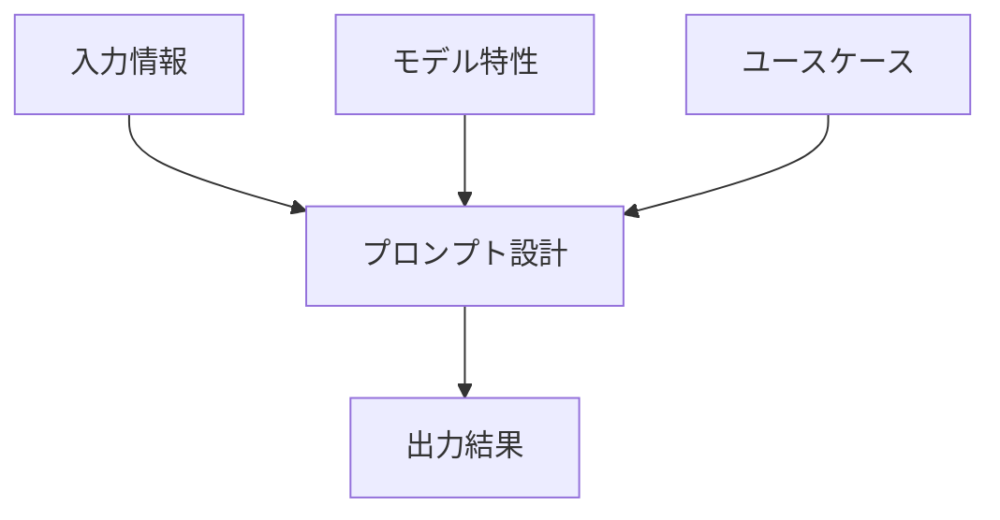

# プロンプト設計 実践ハンズオン

## 1. プロンプト設計の基本原則

### 1.1 プロンプト設計の重要性
効果的なプロンプト設計は生成AIの出力品質を決定する重要な要素です。

適切な設計により：
- 期待する出力形式の正確性向上
- 不要な推測の排除
- 処理時間とコストの最適化

を達成できます。

### 1.2 プロンプト設計の3要素


#### 1.2.1 各要素の詳細解説
**1.2.1.1 入力情報（Input Data）**
- **理想的な入力の条件**：
  - MECE（Mutually Exclusive, Collectively Exhaustive）原則に準拠
    * 相互に排他的で、全体として網羅的な情報構造を構築
    * 例：製品カテゴリ分類で「重複なく、漏れなく」分類
  - 冗長性排除（重複情報なし）
    * 同じ情報の繰り返しを避け、効率的なデータ処理を実現
    * 例：顧客情報で同じ内容を複数箇所に記載しない
  - 構造化されたデータ形式（表/リスト/階層構造）
    * データの関係性を明確にし、AIの理解を容易にする
    * 例：JSON形式やCSV形式でのデータ提供

**1.2.1.2 モデル特性（Model Characteristics）**
- **考慮すべきポイント**：
  - モデルの知識範囲と制限事項
    * 学習データの範囲と更新時期を把握
    * 例：2021年までのデータで学習したモデルに最新情報を提供
  - トークン制限と処理能力
    * 入力と出力の長さを適切に設計
    * 例：長文処理ではチャンク分割を検討
  - 得意なタスクと苦手なタスク
    * モデルの強みを活かした設計
    * 例：Geminiは長文読解や動画認識に強く、Claudeは論理的推論に強い
  - 最新情報の反映状況
    * モデルの知識更新頻度を確認
    * 例：リアルタイム情報が必要な場合はRAGを活用

**1.2.1.3 ユースケース（Use Case）**
- **設計時の検討事項**：
  - 業務目的と期待する成果
    * 具体的なKPIを設定し、成果を測定可能に
    * 例：営業支援では商談成功率向上を目標設定
  - 出力の利用シーンと対象者
    * エンドユーザーの特性を考慮した設計
    * 例：技術者向けなら専門用語を多用、一般向けなら平易な表現
  - 必要な精度レベルと許容範囲
    * エラーの許容度と検証方法を明確化
    * 例：医療分野では99.9%の精度を要求
  - 運用環境と制約条件
    * セキュリティ要件やレスポンス時間を考慮
    * 例：機密情報処理ではオンプレミス環境を選択

**1.2.1.4 ケーススタディ：議事録生成**
```

厳密に設計されたフォーマットなどを指定すれば、より正確な議事録が生成できます。

### 1.2.2 クイズ1

#### 1.2.2.1 問題1:
```
「アップルパイ」という単語、1言のみを出力させてください。
ただしプロンプトに、「アップル」、「パイ」という単語を利用してはいけません。
```
#### 1.2.2.2 問題2:
```
「東京/タワー」という単語のみ出力してください。
ただし「東京」「タワー」「/」「スラッシュ」という単語をプロンプトに入れてはいけません。
```


**1.2.3 プロンプト設計（Prompt Engineering）**
- **最適化フレームワーク**：
  ```mermaid
  flowchart LR
    A[目的定義] --> B[形式指定]
    B --> C[制約条件]
    C --> D[検証基準]
  ```
- **実装する際のチェックリスト**：
  - [ ] 役割定義が明確か
  - [ ] 出力形式が具体的か
  - [ ] 禁止事項が列挙されているか
  - [ ] 必要な情報がすべて揃っているか

**1.2.4 出力結果（Output）**
- **成果物の品質評価基準**：
  - 実際にプロンプトを業務に適応する際は、以下のような成果物の評価基準を設定し、対応していく必要があります。
  - しかし個人利用でそこまで厳密に評価する必要はないので、とりあえずの参考情報程度にとどめてください。
    - ただし業務実装する際は必須となってきます。

  | 評価項目 | 合格基準 | 測定方法 | 詳細説明 |
  |----------|----------|----------|----------|
  | 正確性 | 事実誤認0件 | 専門家レビュー | 生成された内容が事実と完全に一致していることを確認。専門家による内容の精査と検証を実施。 |
  | 完全性 | 必須項目100%包含 | チェックリスト照合 | 指定された全ての要素が漏れなく記載されていることを確認。事前に定義したチェックリストを用いて項目ごとに検証。 |
  | 一貫性 | 文体/フォーマット統一 | 自動検証ツール | 文章全体で文体や表現が統一されていることを確認。フォーマットの整合性を自動ツールで検証し、不整合を検出。 |
  | 有用性 | 実務で即活用可能 | ユーザーテスト | 生成された内容が実際の業務でそのまま使用可能なレベルであることを確認。関係者による使用テストを実施。 |

#### 1.2.4.1 ケーススタディ：営業レポート生成
**Before**:
```markdown
最新の営業データを分析してレポートを作成してください
```

**After**:
```markdown
## 要望
- 役割: 営業分析の専門家
- タスク: 四半期営業報告書作成

## 制約条件
- レポート構成:
  1. 総括: 主要指標の前年比分析
  2. トップ営業担当者: 上位3名の実績と特徴
- 文字数: 3000字以内
- 形式: Markdown
- 締切: 2025-01-31

## 入力情報
- CSVファイル: sales_q4_2024.csv
- APIデータ: customer_feedback
```

### 1.3 コスト最適化のポイント
すべての処理に最上位モデルを利用すれば、最適な回答を生成することは比較的簡単です。
しかしすべてを高コストなLLMモデルで運用してしまうと不必要なコストが発生し、費用対効果の面でマイナスになってしまいます。

そのため、以下のようなコスト最適化のポイントを意識して、プロンプト設計を行うことで、コストパフォーマンスを高めることができます。

| 要素 | 最適化方法 | 期待効果 |
|------|------------|----------|
| トークン数 | 不要な修飾語の削除、冗長な表現の簡略化、重複情報の排除 | 処理コストの適正化、API利用料金の削減 |
| 推論回数 | 明確な指示による再生成回避、具体的な出力例の提示、フォーマットの事前指定 | 実行時間の短縮、リソース使用量の削減 |
| モデル選択 | タスクに適したモデル選定、機能要件と予算のバランス考慮、最新モデルの活用 | 精度とコストの最適バランス、処理速度の向上 |

### 1.4 プロンプト形式の種類と特徴

**プロンプトにも様々な記載方法があり、本格開発ではモデルやケースごとに使い分けていく必要があります。**


### 1.4.1 各形式の特徴比較
| 形式 | メリット | デメリット | 推奨モデル |
|------|----------|------------|------------|
| XML | 構造化しやすくモデルの解釈精度が高い | 記述量が多くなる | Claudeシリーズ |
| Markdown | 可読性が高く汎用性がある | 複雑な構造に弱い | OpenAIシリーズ |
| YAML | 機械可読性に優れる | 人間が編集しにくい | 画像や動画生成によく利用される |
| JSON | データのやり取りに適している | 構造が複雑になりやすい | OpenAI、Claude、Gemini |


**1.4.2 BedrockでのClaudeモデルにおけるXML形式の優位性**：
- Anthropic社の公式ドキュメントでXML形式の推奨が記載（2024年6月リリースのClaude 3.5モデル向けガイド）
- タグ構造が意図の明確化に有効（開始タグと終了タグで範囲を明示）
- 階層的な指示が容易（task、input、outputタグのネスト可能）

### 1.4.3 クイズ1

#### 1.4.3.1 問題1:
```
### 問題
以下の10個の単語をToBeのように分けてください。

**単語リスト**  
- りんご  
- 犬  
- コンピューター  
- チーズ  
- 猫  
- スマートフォン  
- バナナ  
- 馬  
- タブレット  
- 牛乳

### 解答例
**ToBeリスト**  
- A: りんご、チーズ、バナナ、牛乳  
- B: 犬、猫、馬  
- C: コンピューター、スマートフォン、タブレット

```
#### 1.4.3.2 問題2:
```
今までのクイズ問題に類似する新しいプロンプトエンジニアリング問題をプロンプトで作成してください。
また最低3つ以上の問題を作成してください。
```

## 2. 実践的設計テクニック

### 2.1 基本テンプレート
```markdown
### 役割定義
「あなたは〇〇の専門家です」

### タスク指示
「以下の情報をもとに、出力形式に沿って、制約条件を守って整理してください」

### 入力情報
[関連データ/文脈を記載]

### 出力形式
「以下の構成で出力：
- 項目1: 〇〇
- 項目2: △△」

### 制約条件
「以下の条件を厳守：
- 文字数制限: 500字以内
- 専門用語使用禁止」
```

### 2.2 要望プロンプト

#### 2.2.1 Markmap生成タスク
Markmapとは、テキストベースのマインドマップ生成ツールで、Markdown形式で記述することで階層構造を視覚化できるオープンソースのライブラリです。

主な特徴は以下の通りです：

1. シンプルな記法：Markdownのマインドマップ形式で直感的にリスト化
2. リアルタイム可視化：記述しながら即座にマインドマップを確認可能

特に情報整理やアイデア出し、プロジェクト計画の可視化において、直感的で柔軟な表現が可能なツールです。

```markdown
## 要望
- あなたは情報整理の専門家です。
- 以下の入力情報をMarkmap形式で記載し、視覚化してください。

## 制約条件
- 出力形式: Markmap（階層構造を明確にしたマインドマップ）
- 必須階層:
  - 第1階層: 主要カテゴリー（最大5項目）
  - 第2階層: サブカテゴリー（各主要カテゴリーにつき3-5項目）
  - 第3階層: 詳細情報（必要に応じて）
- 文字数制限: 各項目30字以内

## 入力情報
[データ]
```

#### 2.2.2 Mermaidシーケンス図生成タスク
Mermaidとは、テキストベースのダイアグラム生成ツールで、Markdown形式で記述することでフローチャート、シーケンス図、クラス図、ガントチャートなど様々な図を自動生成できるオープンソースのライブラリです。

主な特徴は以下の通りです：

1. シンプルな記法：Markdownライクな構文で直感的に記述可能
2. 多様な図のサポート：フローチャート、シーケンス図、ガントチャートなど
3. バージョン管理が容易：テキストファイルなのでGitでの管理が簡単
4. リアルタイムプレビュー：記述しながら即座に図を確認可能
5. プラットフォーム非依存：様々なエディタやツールで利用可能
6. カスタマイズ性：テーマやスタイルの変更が容易

特にプロジェクトドキュメントや技術文書の作成において、図のメンテナンス性を向上させるのに有効なツールです。

```markdown
## 要望
- あなたは業務プロセス可視化の専門家です。
- 以下の入力情報をMermaidのシーケンス図形式で記載し、視覚化してください。

## 制約条件
- 出力形式: Mermaidシーケンス図
- 必須要素:
  - 作業者の明記
  - 作業タスクの明記
  - ループ/条件分岐: 必要に応じて記載
- 図の複雑さ:
  - 最大3階層のネスト
  - 各メッセージの文字数: 20字以内
- 視覚的要素:
  - 参加者: 四角形で表示
  - メッセージ: 矢印で表示
  - ループ/条件分岐: 枠線で囲む

## 入力情報
[業務タスクの詳細]


## 3. デバッグと改善手法

AIプロンプトのデバッグと改善は、生成AIの出力品質を最適化し、ビジネス価値を高める上で重要なプロセスです。具体的には以下の5つの観点からその重要性が確認できます：

1. ビジネス要件への適合性：AIの出力がビジネスニーズに正確に対応することを担保
2. 業務効率の向上：反復的な修正作業を削減し、生産性を向上させる
3. 情報の信頼性確保：事実誤認や不正確な情報のリスクを最小限に抑える
4. 品質の一貫性維持：複数のプロンプト間で統一された品質基準を確立する
5. コスト効率の最適化：不要な再実行や修正作業によるリソースの浪費を防止する

### 3.1 よくある問題と解決策
| 問題現象 | 原因 | 解決策 |
|---------|------|--------|
| 出力が曖昧で意図した内容と異なる | 指示が抽象的で具体的な要件が不足している | 具体的な例示を追加し、期待する出力の詳細を明記する |
| 出力形式が期待と異なり統一性がない | 出力形式の指定が不明確で詳細な指示がない | 明確なテンプレートを提示し、必須項目やフォーマットを具体的に指定する |
| 事実関係に誤りがあり信頼性が低い | 参照すべき文脈情報が不足している、ルールベースで正しく取得できていない | 関連する参照データを追加し、検証可能な情報源を明示する |

### 3.2 イテレーション改善例
イテレーション改善とは、プロンプト設計において、初期の指示から始めて、出力結果を評価し、そのフィードバックをもとにプロンプトを段階的に改良していくプロセスです。具体的には以下のステップで進めます：

1. ベースライン作成：最初のプロンプトで基本的な指示を出す
2. 結果分析：出力内容を評価し、不足点や改善点を特定
3. プロンプト改良：具体的な指示や制約条件を追加・修正
4. 再実行＆評価：改善後のプロンプトで再度実行し、結果を検証
5. 最適化：期待する出力が得られるまで繰り返し改善
6. プロンプト改善提案：賢いモデル（例：OpenAIのo1シリーズやGemini2.0など）を使用する場合、チャットの最後に「最終的な成果物を作るために、どのようなプロンプトが最適か」を問うことで、モデル自身が改善後のプロンプトを提案可能

このプロセスを繰り返すことで、より精度の高い出力を得ることが可能になります。特に賢いモデルを活用することで、プロンプト設計の効率化と最適化がさらに進みます。

```markdown
# 改善前
「記事の要約を作成してください」

# 改善後 v1
「専門家向け技術記事を3つのポイントに分けて要約（各100字以内）」

# 改善後 v2
「AI技術記事を以下の形式で要約：
1. 核心技術（技術用語使用）
2. 革新点（従来技術との比較）
3. 応用可能性（具体的事例付き）」
```

### 3.3 プロンプト作成のためのメタプロンプト

メタプロンプトとは、AIに対して効果的なプロンプトを生成依頼をするためのプロンプトのことを指します。

つまり、AI自身に「効果的なプロンプト」を作ってもらうための特別なプロンプトです。

以下に、以下に汎用的なメタプロンプトを記載します。
このプロンプトを活用し、内容を深堀することで、意図に沿ったプロンプトを作りましょう。

```markdown
## 要望
あなたはプロンプトを生成する専門家です。ユーザーの要望を整理・分析して、それに合ったプロンプトを作成してください。
プロンプト内には、以下の条件を必ず満たす形で組み立ててください。

1. ユーザーからの要望・目的・前提条件を明確にすること。
2. 不明点がある場合は、追加の情報や確認事項をユーザーにヒアリングする文章を含めること。
3. 生成する最終的なアウトプットは、必ずコードブロック（例: ```plaintext や ```python 等）として囲むこと。

## ステップ
【ステップの提案例】
- ユーザーが実現したいこと・ゴールを特定
- 必要な情報や設定条件の確認
- 上記を踏まえたプロンプト本文の構成
- 不足情報へのヒアリングが必要な場合、その旨を明記
## 制約
作成されたプロンプトは、以下の観点を意識して最適化してください。
- 簡潔かつ具体的
- 利用者が適宜編集しやすいマークダウン形式で記載
- 仕上がりをコードブロックで囲む
## フォーマット
- 要望、ステップ、制約、入力値を「##」で記載
### サンプル

<sample>
## 要望
- ~~
- ~~
## ステップ
- ~~
- ~~
## 制約
- ~~
- ~~
## 入力値
- {{入力値}}
以上の指示に従い、プロンプトを生成してください。
</sample>
```

## 4. 高度なテクニック

### 4.1 Chain-of-Thought（CoT）プロンプティング
**概要**：
複雑な課題を段階的に解決するための手法です。

stepbystepといわれる、タスクを段階的分けて、それぞれをAIに段階的に解決させることで、1つ1つのタスク精度を高めることができる手法です。

まずは推論力の高いAI（例：Claude 3.5 Sonnetなど）に思考過程を明示させ、明確なタスク分割を行います。

その後、最適な推論モデルに思考過程を明示させ、結果を生成させます。

このようにすることで、1のモデル精度に頼らずにタスクごとにモデル選択やプロンプト分割を行うことができ、最終的なコストパフォーマンスや精度を高めることができます。

### 4.2 実践例

以下のように分割したタスクを一度に掲示したり、そもそも処理事態を分けて、分割されたプロンプトを掲示したりすることで、精度を高めることができます。

```markdown
## 要望
あなたは上級システムエンジニアとして、サーバーエラーのトラブルシューティングを行ってください。

## 処理ステップ
1. 【エラー特定】ログからエラーの根本原因を特定
2. 【関連性分析】関連するシステムコンポーネントを洗い出し
3. 【仮説立案】可能性のある原因を3つ挙げる
4. 【検証手順】各仮説を検証する具体的な手順を提示
5. 【解決策提案】優先順位付きの解決策を3案提示

## 出力形式
```plaintext
1. 根本原因: 
   - 特定理由:
   - 関連ログ例:
2. 関連コンポーネント:
   - コンポーネントA: 
   - コンポーネントB:
3. 原因仮説:
   - 仮説1（確度★★★）: 
   - 仮説2（確度★★☆）:
   - 仮説3（確度★☆☆）:
4. 検証手順:
   - 仮説1検証: 
     (1) 手順1
     (2) 手順2
5. 解決案:
   - 最優先案: 
   - 代替案:
```

### 4.3 マルチモデル連携
Chain-of-Thought（CoT）プロンプティングにおいて、各思考ステップごとに最適なモデルを選択することが重要です。タスクの特性に応じて適切なモデルを活用することで、全体の処理効率と出力品質を最大化できます。

| タスク段階 | 推奨モデル | 活用ポイント | 選択理由 |
|------------|------------|--------------|----------|
| タスク分析、分割 | Claude 3.5 Sonnet | 自然言語理解 | 複雑なタスクの分解と論理的思考に優れているため |
| データ処理 | Gemini flash 2.0 | 構造化処理 | 大量データの高速処理と構造化に適しているため |
| 品質検証 | Claude 3.5 Sonnet、Claude 3.5 Haiku | 精密チェック | 細部まで正確に検証し、コストパフォーマンスを考慮できるため |

**最適化例**：
Claude 3.5 Sonnetを中核に、Gemini flash2.0で前処理、Claude 3.5 SonnetやClaude 3.5 Haikuで最終チェックを行うハイブリッド構成が効果的。

## 5. 実践ワークフロー

### 5.1 最適化プロセス
このワークフローは、生成AIを活用した業務プロセスの効率化と品質向上を目的としています。各ステップは、プロンプト設計から改善までのサイクルを体系的に進めるためのものです。

1. タスク定義
   - 目的：プロンプトの方向性を明確化し、無駄な作業を防ぐ
   - 具体的なアクション：
     - 業務目的の特定（例：議事録作成、レポート生成）
     - 期待する出力形式の決定（Markdown、表形式等）
     - 必要な入力情報の整理（データソース、文脈情報）
     - 制約条件の設定（文字数、フォーマット、締切等）

2. モデル選定
   - 目的：タスク特性に最適なモデルを選択し、コストパフォーマンスを最大化
   - 具体的なアクション：
     - タスクの特性分析（自然言語処理、データ処理、精密チェック等）
     - モデル特性の比較（Claude 3.5 Sonnet、Gemini flash2.0等）
     - コストと精度のバランス考慮
     - 必要に応じたマルチモデル連携の検討

3. プロンプト草案
   - 目的：明確で再現性の高いプロンプトを作成し、一貫した出力を確保
   - 具体的なアクション：
     - 基本テンプレートに沿った設計
     - 役割定義（例：専門家、アシスタント）
     - タスク指示の明確化
     - 入力情報の整理と構造化
     - 出力形式の具体化
     - 制約条件の明文化

4. テスト実行
   - 目的：プロンプトの有効性を検証し、改善点を特定
   - 具体的なアクション：
     - 小規模なデータセットでの試行
     - 複数モデルでの比較実施
     - 実行時間とコストの計測
     - 想定外の出力の記録

5. 結果分析
   - 目的：プロンプトの品質を評価し、改善方向を決定
   - 具体的なアクション：
     - 出力品質の評価（正確性、完全性、一貫性）
     - 想定との差異の特定
     - 改善ポイントの洗い出し
     - コストパフォーマンスの分析

6. 改善実施
   - 目的：プロンプトとワークフローを最適化し、持続的な品質向上を図る
   - 具体的なアクション：
     - プロンプトの微調整
     - モデル選択の見直し
     - ワークフローの最適化
     - 自動化可能なプロセスの特定

### 5.2 AI活用によるプロンプト作成、品質管理の自動化の具体例

1. **プロンプト最適化の自動化プロセス**：
   - **Claude 3.5 Sonnetの「メタプロンプト」機能**を活用
     - AIが自動的にプロンプトの作成、改善を支援
     - 反復的な手動修正を削減
   - **Langfuse**などのオープンソースツールを活用した出力品質の定量評価
     - 各実行結果（input × プロンプト）の詳細なログ記録
     - 生成過程と生成結果をAI自身が自動的なスコアリングし、フィードバックを行う
   - 自動改善サイクルのフロー：
     ```mermaid
     graph LR
       A[初期プロンプト実行] --> B[Langfuseによる評価]
       B --> C[Claude 3.5 Sonnetのメタプロンプト機能による改善案自動生成]
       C --> D[最適化プロンプト実行]
       D --> E[品質指標の自動更新]
       E --> F[自動デプロイ]
       F --> A
       style C fill:#f9f,stroke:#333,stroke-width:4px
     ```

2. **モデル選択の最適化に必要な項目と自動化**：
   - **タスク特性分析**によるモデル推薦
     - 長文処理、定量的なデータ処理、精密チェックなどのタスク特性を自動識別
   - **コスト/精度トレードオフ**の自動計算
     - 各モデルの実行コストと期待精度を比較
     - 最適なバランスを自動提案
   - **複数モデル比較**の自動化
     - Claude、Gemini、GPTなどの主要モデルを横断的に評価
     - タスクに最適なモデルを自動選択

3. **品質管理の自動化フレームワーク**：
   - **Langfuse**による主要指標の自動監視：
     - **正確性（Factual Accuracy）**：事実関係の誤りを検出
     - **完全性（Completeness）**：必要な情報が全て含まれているか確認
     - **一貫性（Consistency）**：文体やフォーマットの統一性をチェック
   - **閾値ベースのアラート通知**：
     - 品質指標が設定値を下回った場合、自動的に通知
     - 即時の対応を可能にする

### 6. セキュリティにおけるプロンプトインジェクション対策

#### 6.1 プロンプトインジェクションとは
プロンプトインジェクションは、悪意のあるユーザーがシステムに不正な入力を行い、その結果として意図しない動作や情報漏洩を引き起こす攻撃手法です。この攻撃は、特にAIチャットボットなどの自然言語処理システムで問題となります。

#### 6.2 対策方法
- **入力検証**：ユーザーからのデータを確認し、不正な内容が含まれていないかチェックします。
- **エスケープ処理**：特殊な文字やコマンドを無効化して、誤った実行を防ぎます。
- **最小権限の原則**：システムが必要最低限の権限だけで動くように設定します。これにより、万が一侵入されても被害を抑えられます。
- **監視とログ記録**：不審な活動を常に見張り、記録することで早期発見につながります。
- **定期的なセキュリティテスト**：脆弱性診断やペネトレーションテスト（侵入テスト）を定期的に行い、安全性を確認します。

これらの対策によって、プロンプトインジェクション攻撃からシステムを守ることができます。

### 6.3 セキュリティチェックの自動化
AIシステムのセキュリティを強化し、リスクを最小化するための自動化プロセスについて説明します。

- **機密情報検出の自動化**
  - 個人情報（氏名、住所、電話番号など）や企業機密（特許情報、財務データ、取引先情報など）を自動的に検出
  - 検出された機密情報をマスキングまたは削除することで、意図しない情報漏洩を防止
  - 例：クレジットカード番号やパスポート番号などのセンシティブデータをリアルタイムで検出

- **データ漏洩防止のための自動フィルタリング**
  - 不適切な情報（差別的表現、違法コンテンツ、機密データなど）の出力を自動的にブロック
  - 複数のフィルタリングレイヤーを設定し、誤検知を最小限に抑えつつ、リスクを軽減
  - 例：特定のキーワードやパターンを検出し、出力前に自動的にフィルタリング

- **コンプライアンスチェックの自動実施**
  - GDPRや個人情報保護法などの法規制、および社内セキュリティポリシーに準拠しているかを自動検証
  - コンプライアンス違反の可能性がある場合、即座に警告を発し、適切な対応を促す
  - 例：データ保持期間の監視、アクセスログの自動記録、プライバシー影響評価の実施


## アペンディクス：専門用語解説

### 1. MECE（Mutually Exclusive, Collectively Exhaustive）
- **定義**：相互に排他的で、全体として網羅的である状態
- **解説**：情報整理の際に重複なく、漏れのない分類を行うための原則。プロンプト設計において入力情報を整理する際の重要な指針。

### 2. プロンプトエンジニアリング（Prompt Engineering）
- **定義**：AIモデルに対して最適な出力を得るための指示文設計技術
- **解説**：役割定義、タスク指示、制約条件などを適切に組み合わせることで、AIの出力品質を向上させる手法。

### 3. Chain-of-Thought（CoT）
- **定義**：複雑な課題を段階的に解決するための思考プロセス
- **解説**：タスクを細分化し、各ステップごとに推論を行うことで、全体の精度を高める手法。特にClaude 3.5 Sonnetなどの高度なモデルで有効。

### 4. メタプロンプト（Meta Prompt）
- **定義**：AIに対して効果的なプロンプトを生成依頼するためのプロンプト
- **解説**：AI自身に最適なプロンプト設計を依頼する手法。プロンプト改善の効率化に寄与。

### 5. Langfuse
- **定義**：AI出力の品質管理を行うオープンソースツール
- **解説**：プロンプト実行結果のログ記録、品質指標の自動評価、改善サイクルの自動化を支援。

### 6. コスト/精度トレードオフ（Cost/Accuracy Trade-off）
- **定義**：モデルの実行コストと出力精度の最適なバランスを取ること
- **解説**：タスク特性に応じて、適切なモデルを選択する際の重要な判断基準。

### 7. ハイブリッド構成（Hybrid Architecture）
- **定義**：複数のAIモデルを組み合わせて使用するアーキテクチャ
- **解説**：タスク特性に応じて最適なモデルを選択し、全体のコストパフォーマンスを最大化する手法。

### 8. 自動デプロイ（Auto Deployment）
- **定義**：最適化されたプロンプトを自動的に運用環境に適用するプロセス
- **解説**：プロンプト改善サイクルを効率化し、迅速な改善反映を可能にする仕組み。

### 9. 閾値ベースのアラート通知（Threshold-based Alert）
- **定義**：設定した品質基準を下回った際に自動的に通知する仕組み
- **解説**：AI出力の品質維持のために重要なリアルタイム監視機能。