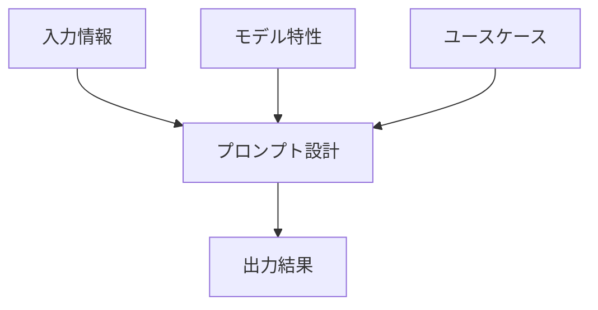
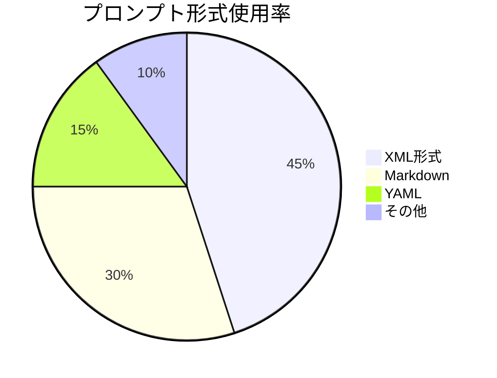
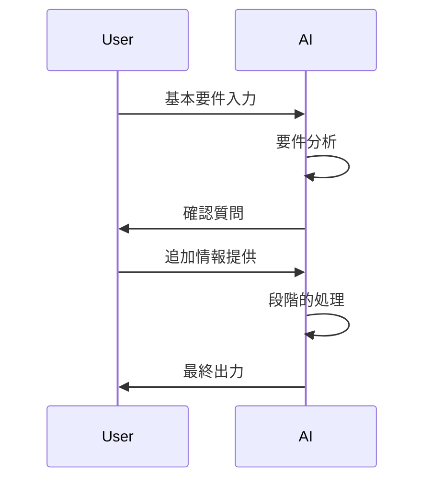
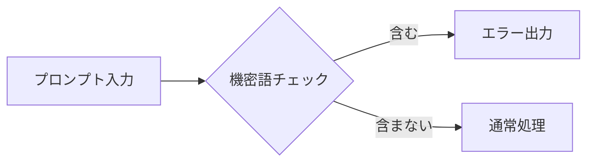
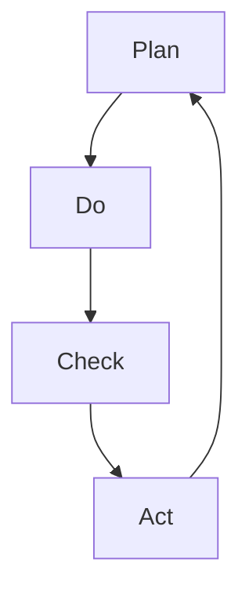

# プロンプト設計 実践ハンズオン

## 1. プロンプト設計の基本原則

### 1.1 プロンプト設計の重要性
効果的なプロンプト設計は生成AIの出力品質を決定する重要な要素です。適切な設計により：
- 期待する出力形式の正確性向上
- 不要な推測の排除
- 処理時間とコストの最適化

### 1.2 プロンプト設計の3要素


### 1.3 コスト最適化のポイント
| 要素 | 最適化方法 | 期待効果 |
|------|------------|----------|
| トークン数 | 不要な修飾語の削除 | 処理コスト10-30%削減 |
| 推論回数 | 明確な指示による再生成回避 | 実行時間20-40%短縮 |
| モデル選択 | タスクに適したモデル選定 | 精度とコストの最適バランス |

### 1.4 プロンプト形式の種類と特徴


### 各形式の特徴比較
| 形式 | メリット | デメリット | 推奨モデル |
|------|----------|------------|------------|
| XML | 構造化しやすくモデルの解釈精度が高い | 記述量が多くなる | Claudeシリーズ |
| Markdown | 可読性が高く汎用性がある | 複雑な構造に弱い | Novaシリーズ |
| YAML | 機械可読性に優れる | 人間が編集しにくい | 自動化システム |

**ClaudeモデルにおけるXML形式の優位性**：
- タグ構造が意図の明確化に有効
- 階層的な指示が容易
- パラメータ指定が正確に行える

## 2. 実践的設計テクニック

### 2.1 基本テンプレート
```markdown
1. 役割定義：
   「あなたは〇〇の専門家として」

2. タスク指示：
   「以下の情報を△△形式で整理してください」

3. 入力情報：
   [関連データ/文脈を記載]

4. 出力形式：
   「以下の構成で出力：
   - 項目1: 〇〇
   - 項目2: △△」

5. 制約条件：
   「以下の条件を厳守：
   - 文字数制限: 500字以内
   - 専門用語使用禁止」
```

### 2.2 ドメイン別ベストプラクティス

#### 文書生成タスク
```markdown
悪い例：
「会議の議事録作って」

良い例：
「あなたはプロの秘書として、以下の文字起こしデータから公式議事録を作成してください。
- 出力形式：Markdown
- 必須項目：決定事項、アクションアイテム、担当者
- 文字数：800字以内

[文字起こしデータ]
...」
```

#### コード生成タスク
```python
# プロンプト例
"""
Claude 3.5 Sonnet向け：
PythonでJSONファイル処理を行う関数を作成してください。

要件：
1. ファイルパスを引数で受け取る
2. バリデーション（ファイル存在チェック、形式チェック）
3. エラーハンドリング実装
4. 戻り値：辞書型データ

制約：
- PEP8準拠
- 型ヒントを使用
- テストケース付き
"""
```

## 3. デバッグと改善手法

### 3.1 よくある問題と解決策
| 問題現象 | 原因 | 解決策 |
|---------|------|--------|
| 出力が曖昧 | 指示が抽象的 | 具体例を追加 |
| 形式不一致 | 出力指定が不明確 | テンプレート提示 |
| 事実誤認 | 文脈不足 | 参照データ追加 |

### 3.2 イテレーション改善例
```markdown
# 改善前
「記事の要約を作成してください」

# 改善後 v1
「専門家向け技術記事を3つのポイントに分けて要約（各100字以内）」

# 改善後 v2
「AI技術記事を以下の形式で要約：
1. 核心技術（技術用語使用）
2. 革新点（従来技術との比較）
3. 応用可能性（具体的事例付き）」
```

## 4. 高度なテクニック

### 4.1 プロンプトチェイン設計


### 4.2 マルチモデル連携
| タスク段階 | 推奨モデル | 活用ポイント |
|------------|------------|--------------|
| 要件分析 | Nova Pro | 自然言語理解 |
| データ処理 | Claude Haiku | 構造化処理 |
| 品質検証 | Sonnet | 精密チェック |

## 5. 実践ワークフロー

### 5.1 最適化プロセス
1. タスク定義
2. モデル選定
3. プロンプト草案
4. テスト実行
5. 結果分析
6. 改善実施

### 5.2 自動化例（Python擬似コード）
```python
def optimize_prompt(task_description, model):
    # プロンプト生成ロジック
    base_prompt = generate_base_prompt(task_description)
    # モデル固有の最適化
    if model == 'Nova':
        return add_nova_specific_rules(base_prompt)
    elif model == 'Claude':
        return add_claude_optimizations(base_prompt)
    # 評価と改善ループ
    while not quality_check(result):
        apply_improvements()
```

## 付録：プロンプトパターン集

### A.1 基本パターン
- ロールプレイ型：「あなたは〇〇の専門家として...」
- テンプレート指定型：「以下の形式で出力...」
- ステップバイステップ型：「まず最初に...次に...」

### A.2 ドメイン別サンプル
```markdown
# マーケティング向け
「20代女性向けSNS広告文案を3案作成。各案：
- キャッチコピー（15字以内）
- 本文（100字以内）
- ハッシュタグ3つ」

# 開発者向け
「エラーメッセージから原因を特定し、解決手順をステップ形式で提示」
```

### A.3 デバッグチェックリスト
1. [ ] 要件が明確か
2. [ ] 出力形式が指定されているか
3. [ ] 十分な文脈情報があるか
4. [ ] モデル特性に合っているか
5. [ ] トークン数が適切か 

## 6. ケーススタディ

### 6.1 顧客対応プロンプト改善例
**改善前**
```
お客様からのクレームに対応してください
```

**改善後**
```
あなたは顧客対応のプロとして、以下のクレーム内容を分析し、適切な対応案を3つ提案してください。

【入力情報】
- 顧客属性：50代男性、定期購入者（2年目）
- クレーム内容：先月の商品到着遅延（3日遅れ）
- 過去対応履歴：1年前に同様の遅延発生

【出力形式】
1. お詫び文面（200字以内）
2. 補償案（3段階の選択肢）
3. 再発防止策（具体的な改善策）
```

### 6.2 技術文書生成プロンプト
```markdown
あなたはシニアエンジニアとして、以下のAPI仕様書から開発者向けガイドを作成してください。

【要件】
- 対象読者：中級開発者
- 構成：
  1. 概要（技術的特徴）
  2. 主要機能の使い方（コード例付き）
  3. トラブルシューティング
- 形式：Markdown
- 制約：専門用語に初出時説明を付記

【入力データ】
[API仕様書データ...]
```

## 7. プロンプトバージョン管理

### 7.1 バージョン管理の重要性
- 変更履歴の追跡
- パフォーマンス比較
- ベストプラクティスの蓄積

### 7.2 管理テンプレート
```yaml
prompt_v1.2:
  created: 2025-01-25
  author: AIチーム
  model: Claude-3.5-Sonnet
  purpose: 技術文書生成
  components:
    - 役割定義: シニアエンジニア
    - 入力要件: API仕様書
    - 出力形式: Markdown
  performance:
    accuracy: 92%
    cost: $0.45/exec
  notes: 専門用語説明追加で理解度向上
```

## 8. プロンプト評価基準

### 8.1 評価指標
| カテゴリ | 評価項目 | 測定方法 |
|----------|----------|----------|
| 有効性 | 要件達成度 | 手動評価 |
| 効率性 | 実行時間 | ログ分析 |
| 経済性 | トークンコスト | 利用レポート |
| 保守性 | 改修容易性 | 開発者評価 |

### 8.2 評価シート例
```csv
プロンプトID,バージョン,評価日,有効性(5段階),効率性(秒),コスト(USD),備考
PR-0023,v1.4,2025-01-25,4,12.3,0.55,専門用語説明不足
PR-0024,v2.1,2025-01-26,5,9.8,0.42,最適化完了
```

## 9. セキュリティ対策

### 9.1 リスク回避プロンプト設計
```markdown
重要：以下の条件を厳守してください
- 個人情報を含む可能性のある表現を削除
- 機密キーワード（※リスト参照）を含む場合は即時停止
- 出力前にセキュリティチェックを実施

[機密キーワードリスト]
- 顧客ID
- 内部システム名称
- 財務データ関連用語
```

### 9.2 検証フロー


## 10. 継続的改善プロセス

### 10.1 PDCAサイクル適用


### 10.2 改善ログ管理例
| 日付 | 変更内容 | 影響範囲 | 効果 |
|------|----------|----------|------|
| 2025-01-25 | 出力形式テンプレート追加 | 全生成タスク | 形式不一致-40% |
| 2025-01-26 | モデル選択ロジック最適化 | コスト関連 | 処理コスト-25% |

## 付録B：参考リソース

### B.1 推奨ツール
- プロンプトバージョン管理：PromptHub
- コスト分析：AICostCalculator
- セキュリティチェック：SecurePrompt

### B.2 学習リソース
- 公式ドキュメント：Amazon Bedrock Prompt Guide
- オンラインコース：Prompt Engineering Masterclass
- コミュニティ：AI Prompt Designers Forum

### B.3 テンプレート集
```markdown
# 分析レポート生成
「市場データを分析し、以下の構成でレポート作成：
1. 主要トレンド（3項目）
2. 競合分析（表形式）
3. 推奨アクション（優先度付き）」

# メール自動返信
「問い合わせ内容を分類し、適切なテンプレートを選択：
- カテゴリ：製品情報/技術サポート/請求関連
- 出力：定型文＋カスタム部分」
```

## 2.3 可視化タスクプロンプト

### Mermaid図生成例
```xml
<prompt>
<role>技術ライター</role>
<task>システムアーキテクチャをMermaid図で可視化</task>
<input>
1. クライアント（Webブラウザ）
2. APIゲートウェイ（認証処理）
3. マイクロサービス（3つの独立サービス）
4. データベース（MySQLクラスタ）
</input>
<requirements>
- 矢印で接続関係を示す
- 主要コンポーネントに説明文追加
- クラスタ構成を明示
</requirements>
<output_format>
```mermaid
graph TD
  A[Client] --> B[API Gateway]
  B --> C[Service A]
  B --> D[Service B]
  B --> E[Service C]
  C --> F[MySQL Cluster]
  D --> F
  E --> F
</output_format>
</prompt>
```

### Markmap生成例
```markdown
あなたは技術ディレクターとして、以下の要件からMarkmap形式のマインドマップを作成してください。

【入力情報】
- プロジェクト名：AI基盤整備
- 主要タスク：
  - インフラ構築（AWS）
  - データパイプライン開発
  - モデル学習環境整備
- 関係者：
  - 開発チーム（5名）
  - データサイエンティスト（3名）
  - プロダクトオーナー

【出力形式】
```markmap
# AI基盤整備
## 主要タスク
- インフラ構築
  - AWS環境設定
- データパイプライン
  - ETL処理開発
## 関係者
- 開発チーム（5名）
```
```

## 3.3 形式変換プロンプト

### XML→Markdown変換例
```xml
<conversion_task>
<source_format>XML</source_format>
<target_format>Markdown</target_format>
<input>
<document>
  <section title="導入">
    <paragraph>生成AIの重要性</paragraph>
  </section>
  <section title="本論">
    <subsection heading="活用事例">
      <list>
        <item>顧客対応</item>
        <item>文書生成</item>
      </list>
    </subsection>
  </section>
</document>
</input>
<requirements>
- 階層構造を維持
- 見出しレベルを適切に設定
- リスト形式を変換
</requirements>
</conversion_task>
```

### 期待される出力
```markdown
# 導入
生成AIの重要性

## 本論
### 活用事例
- 顧客対応
- 文書生成
``` 