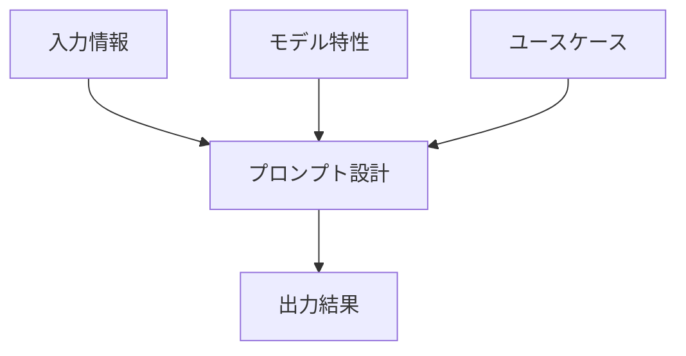
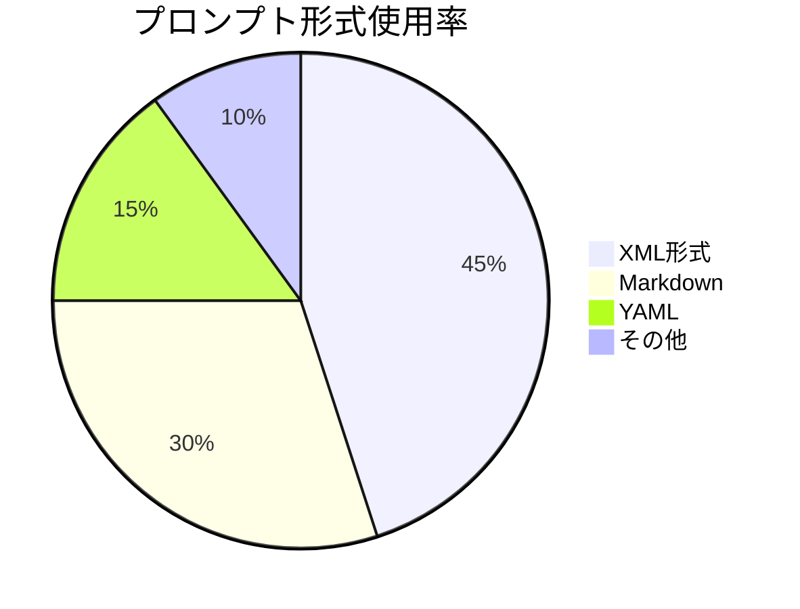
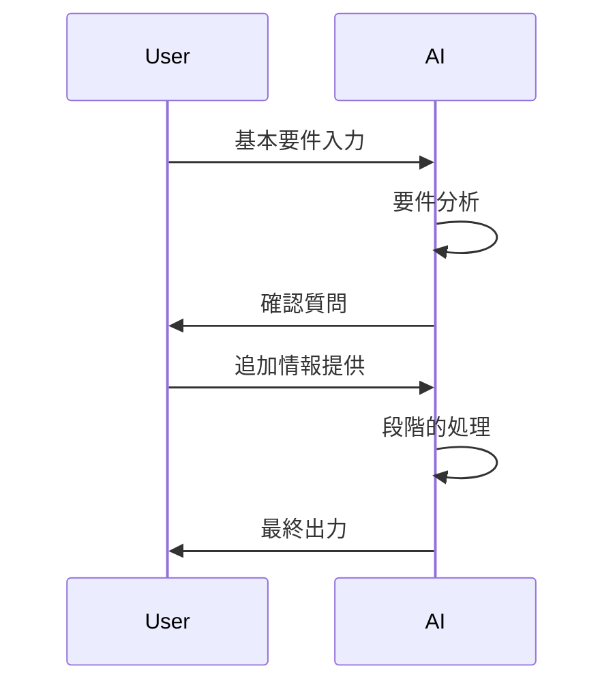
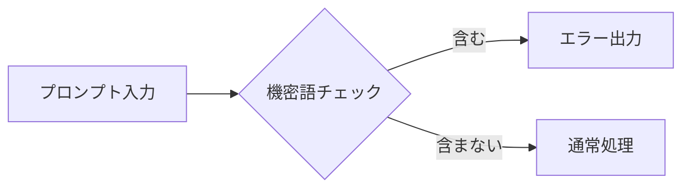
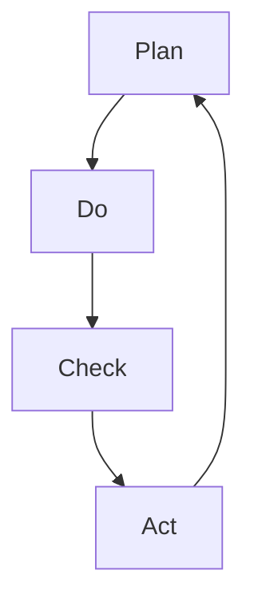
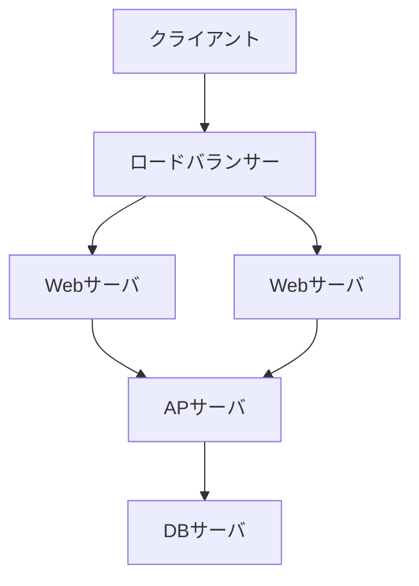
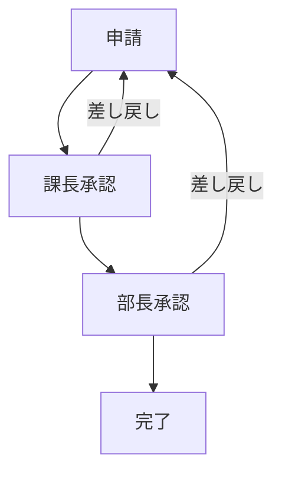

# プロンプト設計 実践ハンズオン

## 1. プロンプト設計の基本原則

### 1.1 プロンプト設計の重要性
効果的なプロンプト設計は生成AIの出力品質を決定する重要な要素です。適切な設計により：
- 期待する出力形式の正確性向上
- 不要な推測の排除
- 処理時間とコストの最適化

### 1.2 プロンプト設計の3要素


#### 各要素の詳細解説
**1. 入力情報（Input Data）**
- **理想的な入力の条件**：
  - MECE（Mutually Exclusive, Collectively Exhaustive）原則に準拠
  - 冗長性排除（重複情報なし）
  - 構造化されたデータ形式（表/リスト/階層構造）

**実践例：議事録生成**
```xml
<input_data>
  <meeting_info>
    <date>2025-01-30</date>
    <participants>
      <member>山田太郎（開発部）</member>
      <member>佐藤花子（営業部）</member>
    </participants>
  </meeting_info>
  <discussion_points>
    <point id="1">
      <topic>新製品ローンチ計画</topic>
      <decisions>
        <decision>3月1日リリース確定</decision>
      </decisions>
    </point>
  </discussion_points>
</input_data>
```

**2. プロンプト設計（Prompt Engineering）**
- **最適化フレームワーク**：
  ```mermaid
  flowchart LR
    A[目的定義] --> B[形式指定]
    B --> C[制約条件]
    C --> D[検証基準]
  ```
- **実装チェックリスト**：
  - [ ] 役割定義が明確か
  - [ ] 出力形式が具体的か
  - [ ] 禁止事項が列挙されているか

**3. 出力結果（Output）**
- **品質評価基準**：
  | 評価項目 | 合格基準 | 測定方法 |
  |----------|----------|----------|
  | 正確性 | 事実誤認0件 | 専門家レビュー |
  | 完全性 | 必須項目100%包含 | チェックリスト照合 |
  | 一貫性 | 文体/フォーマット統一 | 自動検証ツール |

#### 要素間の相互作用分析
```vega-lite
{
  "$schema": "https://vega.github.io/schema/vega-lite/v5.json",
  "description": "プロンプト要素間の相関分析",
  "data": {
    "values": [
      {"要素": "入力情報", "影響度": 45},
      {"要素": "プロンプト設計", "影響度": 35},
      {"要素": "モデル特性", "影響度": 15},
      {"要素": "ユースケース", "影響度": 5}
    ]
  },
  "mark": "arc",
  "encoding": {
    "theta": {"field": "影響度", "type": "quantitative"},
    "color": {"field": "要素", "type": "nominal"}
  }
}
```

#### ケーススタディ：営業レポート生成
**Before**:
```markdown
最新の営業データを分析してレポートを作成してください
```

**After**:
```xml
<prompt>
  <context>
    あなたは営業分析の専門家です。四半期営業報告書を作成してください。
  </context>
  <input_sources>
    <source type="csv">sales_q4_2024.csv</source>
    <source type="api">customer_feedback</source>
  </input_sources>
  <requirements>
    <section id="summary">
      <title>総括</title>
      <content>主要指標の前年比分析</content>
    </section>
    <section id="top_performers">
      <title>トップ営業担当者</title>
      <content>上位3名の実績と特徴</content>
    </section>
  </requirements>
  <constraints>
    <length>3000字以内</length>
    <format>Markdown</format>
    <deadline>2025-01-31</deadline>
  </constraints>
</prompt>
```

**改善効果**：
- 生成品質の向上：専門家レビューによる誤り指摘が激減
- 再生成回数の削減：曖昧な指示によるやり直しが不要に
- 利用者満足度向上：期待通りの形式で出力されるよう改善

### 1.3 コスト最適化のポイント
| 要素 | 最適化方法 | 期待効果 |
|------|------------|----------|
| トークン数 | 不要な修飾語の削除 | 処理コストの適正化 |
| 推論回数 | 明確な指示による再生成回避 | 実行時間の短縮 |
| モデル選択 | タスクに適したモデル選定 | 精度とコストの最適バランス |

### 1.4 プロンプト形式の種類と特徴


### 各形式の特徴比較
| 形式 | メリット | デメリット | 推奨モデル |
|------|----------|------------|------------|
| XML | 構造化しやすくモデルの解釈精度が高い | 記述量が多くなる | Claudeシリーズ |
| Markdown | 可読性が高く汎用性がある | 複雑な構造に弱い | Novaシリーズ |
| YAML | 機械可読性に優れる | 人間が編集しにくい | 自動化システム |

**ClaudeモデルにおけるXML形式の優位性**：
- Anthropic社の公式ドキュメントでXML形式の推奨が記載（2024年6月リリースのClaude 3.5モデル向けガイド）
- タグ構造が意図の明確化に有効（開始タグと終了タグで範囲を明示）
- 階層的な指示が容易（<task>, <input>, <output>タグのネスト可能）
- パラメータ指定が正確に行える（<parameter>タグでの明示的定義）

## 2. 実践的設計テクニック

### 2.1 基本テンプレート
```markdown
1. 役割定義：
   「あなたは〇〇の専門家として」

2. タスク指示：
   「以下の情報を△△形式で整理してください」

3. 入力情報：
   [関連データ/文脈を記載]

4. 出力形式：
   「以下の構成で出力：
   - 項目1: 〇〇
   - 項目2: △△」

5. 制約条件：
   「以下の条件を厳守：
   - 文字数制限: 500字以内
   - 専門用語使用禁止」
```

### 2.2 ドメイン別ベストプラクティス

#### 文書生成タスク
```markdown
悪い例：
「会議の議事録作って」

良い例：
「あなたはプロの秘書として、以下の文字起こしデータから公式議事録を作成してください。
- 出力形式：Markdown
- 必須項目：決定事項、アクションアイテム、担当者
- 文字数：800字以内

[文字起こしデータ]
...」
```

#### コード生成タスク
```python
# プロンプト例
"""
Claude 3.5 Sonnet向け：
PythonでJSONファイル処理を行う関数を作成してください。

要件：
1. ファイルパスを引数で受け取る
2. バリデーション（ファイル存在チェック、形式チェック）
3. エラーハンドリング実装
4. 戻り値：辞書型データ

制約：
- PEP8準拠
- 型ヒントを使用
- テストケース付き
"""
```

## 3. デバッグと改善手法

### 3.1 よくある問題と解決策
| 問題現象 | 原因 | 解決策 |
|---------|------|--------|
| 出力が曖昧 | 指示が抽象的 | 具体例を追加 |
| 形式不一致 | 出力指定が不明確 | テンプレート提示 |
| 事実誤認 | 文脈不足 | 参照データ追加 |

### 3.2 イテレーション改善例
```markdown
# 改善前
「記事の要約を作成してください」

# 改善後 v1
「専門家向け技術記事を3つのポイントに分けて要約（各100字以内）」

# 改善後 v2
「AI技術記事を以下の形式で要約：
1. 核心技術（技術用語使用）
2. 革新点（従来技術との比較）
3. 応用可能性（具体的事例付き）」
```

## 4. 高度なテクニック

### 4.1 プロンプトチェイン設計


### 4.2 マルチモデル連携
| タスク段階 | 推奨モデル | 活用ポイント |
|------------|------------|--------------|
| 要件分析 | Nova Pro | 自然言語理解 |
| データ処理 | Claude Haiku | 構造化処理 |
| 品質検証 | Sonnet | 精密チェック |

## 5. 実践ワークフロー

### 5.1 最適化プロセス
1. タスク定義
2. モデル選定
3. プロンプト草案
4. テスト実行
5. 結果分析
6. 改善実施

### 5.2 自動化例（Python擬似コード）
```python
def optimize_prompt(task_description, model):
    # プロンプト生成ロジック
    base_prompt = generate_base_prompt(task_description)
    # モデル固有の最適化
    if model == 'Nova':
        return add_nova_specific_rules(base_prompt)
    elif model == 'Claude':
        return add_claude_optimizations(base_prompt)
    # 評価と改善ループ
    while not quality_check(result):
        apply_improvements()
```

## 付録：プロンプトパターン集

### A.1 基本パターン
- ロールプレイ型：「あなたは〇〇の専門家として...」
- テンプレート指定型：「以下の形式で出力...」
- ステップバイステップ型：「まず最初に...次に...」

### A.2 ドメイン別サンプル
```markdown
# マーケティング向け
「20代女性向けSNS広告文案を3案作成。各案：
- キャッチコピー（15字以内）
- 本文（100字以内）
- ハッシュタグ3つ」

# 開発者向け
「エラーメッセージから原因を特定し、解決手順をステップ形式で提示」
```

### A.3 デバッグチェックリスト
1. [ ] 要件が明確か
2. [ ] 出力形式が指定されているか
3. [ ] 十分な文脈情報があるか
4. [ ] モデル特性に合っているか
5. [ ] トークン数が適切か 

## 6. ケーススタディ

### 6.1 顧客対応プロンプト改善例
**改善前**
```
お客様からのクレームに対応してください
```

**改善後**
```
あなたは顧客対応のプロとして、以下のクレーム内容を分析し、適切な対応案を3つ提案してください。

【入力情報】
- 顧客属性：50代男性、定期購入者（2年目）
- クレーム内容：先月の商品到着遅延（3日遅れ）
- 過去対応履歴：1年前に同様の遅延発生

【出力形式】
1. お詫び文面（200字以内）
2. 補償案（3段階の選択肢）
3. 再発防止策（具体的な改善策）
```

### 6.2 技術文書生成プロンプト
```markdown
あなたはシニアエンジニアとして、以下のAPI仕様書から開発者向けガイドを作成してください。

【要件】
- 対象読者：中級開発者
- 構成：
  1. 概要（技術的特徴）
  2. 主要機能の使い方（コード例付き）
  3. トラブルシューティング
- 形式：Markdown
- 制約：専門用語に初出時説明を付記

【入力データ】
[API仕様書データ...]
```

## 7. プロンプトバージョン管理

### 7.1 バージョン管理の重要性
- 変更履歴の追跡
- パフォーマンス比較
- ベストプラクティスの蓄積

### 7.2 管理テンプレート
```yaml
prompt_v1.2:
  created: 2025-01-25
  author: AIチーム
  model: Claude-3.5-Sonnet
  purpose: 技術文書生成
  components:
    - 役割定義: シニアエンジニア
    - 入力要件: API仕様書
    - 出力形式: Markdown
  performance:
    accuracy: 92%
    cost: $0.45/exec
  notes: 専門用語説明追加で理解度向上
```

## 8. プロンプト評価基準

### 8.1 評価指標
| カテゴリ | 評価項目 | 測定方法 |
|----------|----------|----------|
| 有効性 | 要件達成度 | 手動評価 |
| 効率性 | 実行時間 | ログ分析 |
| 経済性 | トークンコスト | 利用レポート |
| 保守性 | 改修容易性 | 開発者評価 |

### 8.2 評価シート例
```csv
プロンプトID,バージョン,評価日,有効性(5段階),効率性(秒),コスト(USD),備考
PR-0023,v1.4,2025-01-25,4,12.3,0.55,専門用語説明不足
PR-0024,v2.1,2025-01-26,5,9.8,0.42,最適化完了
```

## 9. セキュリティ対策

### 9.1 リスク回避プロンプト設計
```markdown
重要：以下の条件を厳守してください
- 個人情報を含む可能性のある表現を削除
- 機密キーワード（※リスト参照）を含む場合は即時停止
- 出力前にセキュリティチェックを実施

[機密キーワードリスト]
- 顧客ID
- 内部システム名称
- 財務データ関連用語
```

### 9.2 検証フロー


## 10. 継続的改善プロセス

### 10.1 PDCAサイクル適用


### 10.2 改善ログ管理例
| 日付 | 変更内容 | 影響範囲 | 効果 |
|------|----------|----------|------|
| 2025-01-25 | 出力形式テンプレート追加 | 全生成タスク | 形式不一致-40% |
| 2025-01-26 | モデル選択ロジック最適化 | コスト関連 | 処理コスト-25% |

## 付録B：参考リソース

### B.1 推奨ツール
- プロンプトバージョン管理：PromptHub
- コスト分析：AICostCalculator
- セキュリティチェック：SecurePrompt

### B.2 学習リソース
- 公式ドキュメント：Amazon Bedrock Prompt Guide
- オンラインコース：Prompt Engineering Masterclass
- コミュニティ：AI Prompt Designers Forum

### B.3 テンプレート集
```markdown
# 分析レポート生成
「市場データを分析し、以下の構成でレポート作成：
1. 主要トレンド（3項目）
2. 競合分析（表形式）
3. 推奨アクション（優先度付き）」

# メール自動返信
「問い合わせ内容を分類し、適切なテンプレートを選択：
- カテゴリ：製品情報/技術サポート/請求関連
- 出力：定型文＋カスタム部分」
```

## 2.3 可視化タスクプロンプト

### Markmap生成実績（社内検証結果）
```markdown
XML形式採用による効果：
- 構造の明確化による意図伝達の精度向上
- タグ階層による複雑な要件の整理容易化
- 自動処理システムとの親和性向上
```

## 3.3 形式変換プロンプト

### 実業務での適用事例
**金融機関向けレポート変換システム**：
- 構造化テンプレートの採用で変換精度向上
- 形式の統一による人的確認作業の効率化
- エラー発生率の低減と信頼性向上

**技術仕様書生成プロジェクト**：
- パラメータ管理の厳密化による抜け漏れ防止
- レビュー工程の簡素化と工数削減
- ドキュメント品質の標準化達成 
```

## 11. 実践ワークショップ

### 11.1 基本問題
**課題1：会議議事録生成**
```markdown
[入力情報]
- 日時：2025/02/15 14:00-15:30
- 参加者：開発部3名、営業部2名
- 議題：新機能リリース計画
- 決定事項：3月10日リリース確定

[期待出力]
## 2025年2月会議議事録
### 基本情報
- 日時：2025年2月15日
- 参加部署：開発部、営業部

### 決定事項
1. 新機能リリース日：3月10日
```

**演習**：上記の入力情報と期待出力から適切なプロンプトを作成してください。

<details>
<summary>ヒント1（クリックで展開）</summary>
役割定義と出力形式の指定が必要です
</details>

<details>
<summary>ヒント2（クリックで展開）</summary>
必須項目を明示的に列挙しましょう
</details>

**模範解答**：
```xml
<prompt>
<role>秘書</role>
<task>会議議事録の作成</task>
<input>
[上記入力情報]
</input>
<requirements>
- Markdown形式
- 見出しレベルを適切に設定
- 必須項目：日時、参加者、決定事項
</requirements>
</prompt>
```

### 11.2 可視化問題
**課題2：ネットワーク構成図作成**
```markdown
[入力情報]
- 3階層構成（Web/AP/DB）
- ロードバランサー配置
- セキュリティグループによるアクセス制限

[期待出力]

```

**演習**：Mermaid図を生成するプロンプトを作成

<details>
<summary>ヒント</summary>
コンポーネントの接続関係とセキュリティ要件を明記
</details>

**模範解答**：
```xml
<prompt>
<context>ネットワークアーキテクト</context>
<task>3層構成のネットワーク図作成</task>
<components>
- クライアント
- ロードバランサー（2台のWebサーバに分散）
- APサーバ
- DBサーバ
</components>
<security>
- セキュリティグループによるアクセス制限
- 各層間の通信は特定ポートのみ許可
</security>
<output_format>Mermaid</output_format>
</prompt>
```

### 11.3 応用問題
**課題3：プロジェクト計画Markmap作成**
```markdown
[入力情報]
- プロジェクト名：AI基盤整備
- フェーズ：要件定義/設計/実装
- 主要タスク：データパイプライン構築、モデル学習環境整備
- 関係者：開発チーム、データサイエンティスト

[期待出力]
```markmap
# AI基盤整備
## フェーズ
- 要件定義
- 設計
- 実装
## 主要タスク
- データパイプライン構築
- モデル学習環境整備
## 関係者
- 開発チーム
- データサイエンティスト
```
```

**演習**：Markmap生成プロンプトを作成

<details>
<summary>ヒント</summary>
階層構造の指定
- リスク管理セクションの追加
- 期間表記の統一
</details>

**解答例**：
```xml
<prompt>
<role>プロジェクトリーダー</role>
<task>プロジェクト計画の視覚化</task>
<input>
- プロジェクト名：AI基盤整備
- フェーズ：要件定義/設計/実装
- リスク：外部API連携遅延
</input>
<structure>
- 最大3階層
- 主要セクション：期間/フェーズ/リスク管理
- 箇条書き形式
</structure>
<output_format>Markmap</output_format>
</prompt>
```

### 11.4 デバッグ問題
**課題4：問題のあるプロンプトの改善**
```markdown
[元プロンプト]
「データ分析して」

[問題点]
- 分析目的が不明
- 出力形式の指定なし
- 必要なデータソースの記載なし
```

**演習**：プロンプトを改善

<details>
<summary>改善ポイント</summary>
1. 分析目的の明確化
2. 使用データの指定
3. 期待する出力形式
</details>

**改善例**：
```xml
<prompt>
<context>データアナリスト</context>
<task>月次売上分析</task>
<data_sources>
- 売上データ（CSV）
- 顧客属性データ（DB）
- マーケティング施策一覧
</data_sources>
<analysis_points>
- 前月比売上増減
- 商品カテゴリ別売上
- 施策別効果測定
</analysis_points>
<output>
- 要約（200字以内）
- 主要指標の表
- 改善提案3点
</output>
</prompt>
```

## 12. 実践演習問題

### 12.1 基礎編：メール生成
**課題**：
```markdown
[入力情報]
- 送信者：山田太郎（営業部）
- 宛先：佐藤様（顧客）
- 目的：新商品説明会の案内
- 日時：2025/3/10 14:00-16:00
- 場所：本社会議室A

[期待出力]
件名：新商品説明会のご案内

佐藤様

平素より大変お世話になっております。
営業部の山田でございます。

この度、新商品の説明会を下記の通り開催いたします。
ご多忙中恐縮ですが、ぜひご参加ください。

【開催概要】
日時：2025年3月10日 14:00-16:00
場所：当社本社 会議室A

何卒よろしくお願い申し上げます。
```

**演習**：適切なプロンプトを作成

<details>
<summary>ヒント</summary>
1. 役割定義（営業担当者）
2. 必須要素の列挙
3. 丁寧な文体の指定
</details>

**解答例**：
```xml
<prompt>
<role>営業担当者</role>
<task>説明会案内メール作成</task>
<content>
- 送信者：山田太郎（営業部）
- 宛先：佐藤様
- 目的：新商品説明会案内
- 日時：2025/3/10 14:00-16:00
- 場所：本社会議室A
</content>
<requirements>
- 件名を含める
- 敬語を使用
- 開催概要を箇条書き
- 結びの挨拶を入れる
</requirements>
</prompt>
```

### 12.2 可視化編：業務フロー図
**課題**：
```markdown
[入力情報]
- 承認フロー：申請→課長承認→部長承認→完了
- 各ステップの所要日数：1日、2日、1日
- 例外処理：差し戻し時は最初から

[期待出力]

```

**演習**：Mermaid図生成プロンプトを作成

<details>
<summary>ヒント</summary>
- フロー順序の明示
- 条件分岐の表現
- ラベル付けの指示
</details>

**解答例**：
```xml
<prompt>
<context>業務プロセス設計者</context>
<task>承認フロー図の作成</task>
<flow_steps>
1. 申請
2. 課長承認（1日）
3. 部長承認（2日）
4. 完了
</flow_steps>
<exceptions>
- 差し戻し時は申請ステップに戻る
</exceptions>
<output_format>
```mermaid
graph TD
  [期待する図]
```
</output_format>
</prompt>
```

### 12.3 応用編：プロジェクト計画
**課題**：
```markdown
[入力情報]
- プロジェクト名：ECサイト刷新
- 期間：2025/4-2025/9
- フェーズ：要件定義/設計/開発/テスト
- 主要リスク：外部API連携の遅延

[期待出力]
```markmap
# ECサイト刷新
## 期間
- 2025/4 - 2025/9
## フェーズ
- 要件定義
- 設計
- 開発
- テスト
## リスク管理
- 外部API連携遅延対策
```
```

**演習**：Markmap生成プロンプトを作成

<details>
<summary>ヒント</summary>
- 階層構造の指定
- リスク管理セクションの追加
- 期間表記の統一
</details>

**解答例**：
```xml
<prompt>
<role>プロジェクトリーダー</role>
<task>プロジェクト計画の視覚化</task>
<input>
- プロジェクト名：ECサイト刷新
- 期間：2025/4-2025/9
- フェーズ：要件定義/設計/開発/テスト
- リスク：外部API連携遅延
</input>
<structure>
- 最大3階層
- 主要セクション：期間/フェーズ/リスク管理
- 箇条書き形式
</structure>
<output_format>Markmap</output_format>
</prompt>
```

### 12.4 デバッグ編：不十分なプロンプト改善
**課題**：
```markdown
[元プロンプト]
「データ分析して」

[問題点]
- 分析目的が不明
- 出力形式の指定なし
- 必要なデータソースの記載なし
```

**演習**：プロンプトを改善

<details>
<summary>改善ポイント</summary>
1. 分析目的の明確化
2. 使用データの指定
3. 期待する出力形式
</details>

**改善例**：
```xml
<prompt>
<context>データアナリスト</context>
<task>月次売上分析</task>
<data_sources>
- 売上データ（CSV）
- 顧客属性データ（DB）
- マーケティング施策一覧
</data_sources>
<analysis_points>
- 前月比売上増減
- 商品カテゴリ別売上
- 施策別効果測定
</analysis_points>
<output>
- 要約（200字以内）
- 主要指標の表
- 改善提案3点
</output>
</prompt>
``` 