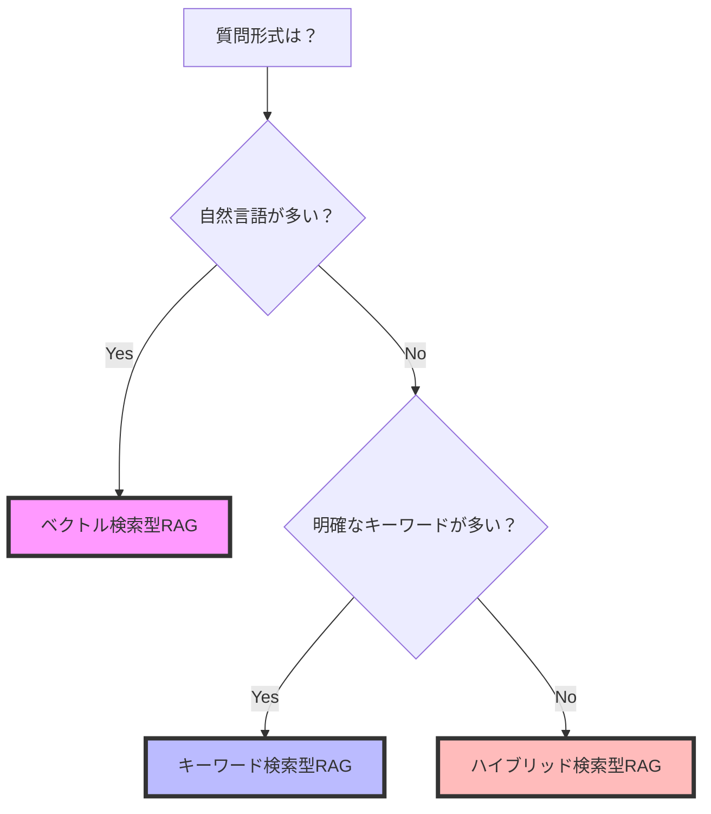
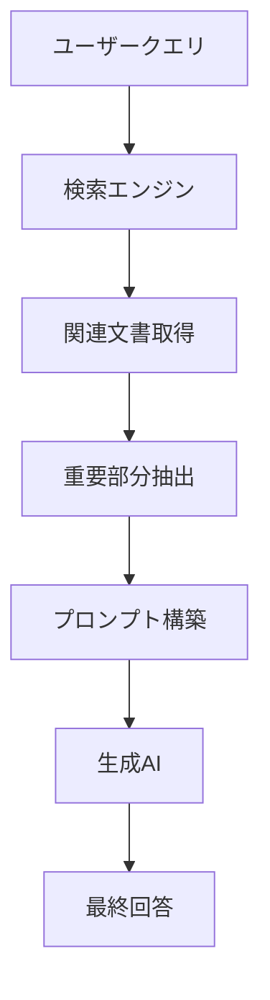
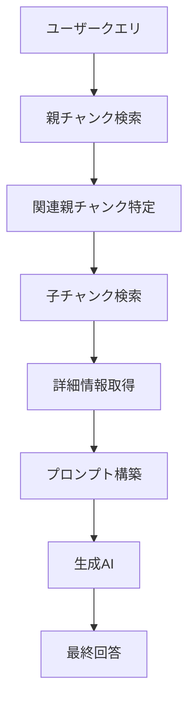
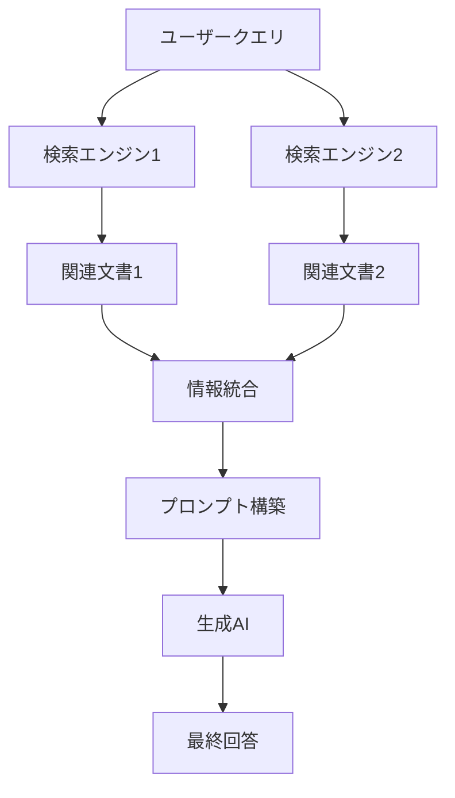
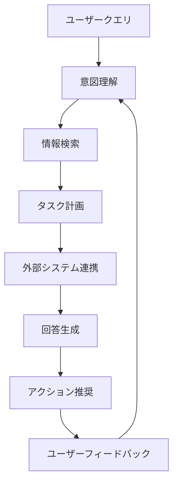
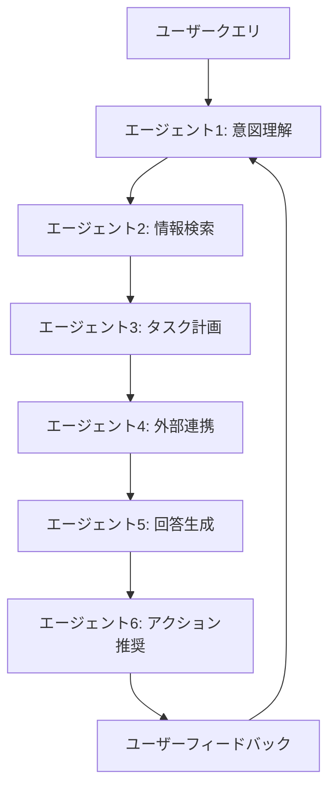

# RAG（Retrieval Augmented Generation）実践活用ガイド

## 第1章 RAGの基本理解
### 1.1 RAGとは何か
Retrieval Augmented Generation（RAG）は、生成AIと情報検索システムを統合した革新的なアーキテクチャです。従来の生成AIモデルが持つ知識は学習時点で固定されており、最新情報や専門的な知識に対応できないという課題を解決します。RAGシステムは、ユーザーの質問に対してまず関連する文書を検索し、その内容を基に回答を生成するため、常に最新の情報を反映した正確な回答が可能になります。

RAGの最大の特徴は、外部の知識ベースと連動することで、生成AIの知識範囲を拡張できる点にあります。例えば、医療分野では最新の研究論文や臨床試験データを、製造業では品質管理マニュアルや過去の不具合報告書を即時反映できます。これにより、専門性の高い質問にも正確に対応できるようになります。

### 1.2 RAGが解決する3大課題
1. **知識の鮮度問題**  
生成AIモデルは学習時点の知識で固定されるため、最新情報や社内限定情報に対応できない課題を解決。外部データベースと連動することで常に最新情報を反映可能にします。例えば、法改正や規制変更が発生した場合でも、関連文書を更新するだけで最新の情報を提供できます。

2. **事実誤認リスク低減**  
生成AIが持つ「Hallucination（虚構生成）」の問題を、信頼できる情報源に基づいた回答生成で軽減。医療現場での薬剤情報提示や金融機関の規制文書参照など、正確性が求められる場面で威力を発揮します。具体的には、回答の根拠となる文書を提示することで、ユーザーが情報の信頼性を確認できる仕組みを提供します。

3. **ドメイン特化コスト**  
自社固有の知識を反映させるために大規模なモデル再学習が必要だった従来方式と異なり、文書追加のみで専門知識を組み込める特徴があります。これにより、特定の業界や企業に特化した知識を迅速に反映でき、運用コストを大幅に削減できます。

### 1.3 RAGの動作フロー```mermaid
graph TD
    A[ユーザークエリ] --> B[クエリ解析]
    B --> C[検索エンジン]
    C --> D[知識ベース]
    D --> E[関連文書取得]
    E --> F[プロンプト構築]
    F --> G[生成AI]
    G --> H[検証プロセス]
    H --> I[最終回答]
    
    subgraph 知識ベース
        D1[製品マニュアル]
        D2[技術文書]
        D3[議事録]
        D4[規格書]
    end
```

## 第2章 RAGの主要な種類
### 2.1 ベクトル検索型RAG
ベクトル検索型RAGは、文章の意味を数値ベクトルに変換し、数学的な類似度計算で関連文書を検索する技術です。この方式の最大の特徴は、自然な表現の質問に対応できる点にあります。例えば、「自動車」と「クルマ」が同じ意味として扱えるため、ユーザーがどのような表現で質問しても適切な回答を生成できます。

ベクトル検索の利点は、文脈を理解した検索が可能な点です。例えば、「環境に優しい移動手段」という質問に対して、電気自動車や自転車に関する文書を関連付けることができます。ただし、計算リソースを多く必要とするため、大規模な文書群を扱う場合には処理速度に注意が必要です。

### 2.2 キーワード検索型RAG
キーワード検索型RAGは、従来の全文検索技術を基にした方式です。特定のキーワードに基づいて文書を検索するため、処理速度が速く、大規模な文書群を扱う場合に適しています。例えば、製品名や規格番号など、明確なキーワードが存在する場合に効果を発揮します。

しかし、類義語や同義語に対応できないという課題があります。例えば、「自動車」と「クルマ」が同じ意味として扱えないため、ユーザーが異なる表現で質問した場合に適切な回答を生成できない可能性があります。このため、専門用語が多く、明確なキーワードが存在する文書群に適しています。

### 2.3 ハイブリッド検索型RAG
ハイブリッド検索型RAGは、ベクトル検索とキーワード検索を組み合わせた方式です。この方式の最大の特徴は、精度と速度のバランスを最適化できる点にあります。例えば、まずキーワード検索で候補文書を絞り込み、その後ベクトル検索で関連性の高い文書を特定するといった方法が取られます。

ハイブリッド検索の利点は、大規模な文書群を扱う場合でも高速かつ正確な検索が可能な点です。また、ユーザーの質問形式に応じて検索方法を自動的に切り替えることができるため、幅広い質問に対応できます。ただし、システム構成が複雑になるため、運用コストに注意が必要です。

### 2.4 RAG種別の比較表
| 比較項目        | ベクトル検索型RAG | キーワード検索型RAG | ハイブリッド検索型RAG |
|-----------------|--------------------|---------------------|-----------------------|
| 検索精度        | 高（文脈理解）     | 中（キーワード依存）| 高（両方式の組み合わせ）|
| 処理速度        | 低（計算リソース要）| 高（高速処理）      | 中（バランス型）      |
| 類義語対応      | ○                 | ×                   | ○                     |
| 大規模文書対応  | △                 | ○                   | ○                     |
| 運用コスト      | 高                 | 低                  | 中                    |
| 適応場面        | 自然言語質問       | 明確なキーワード    | 幅広い質問形式        |

### 2.5 RAG種別の選択ガイド


## 第3章 RAGの基盤技術
### 3.1 ベクトルデータベース（Vector DB）
ベクトルデータベースは、テキストや画像などのデータを数値ベクトルとして保存し、高速な類似度検索を可能にする特殊なデータベースです。RAGシステムにおいて、文書の意味を数値化して保存し、ユーザーの質問に基づいて関連文書を迅速に検索するために使用されます。

**主な特徴**：
- **高速検索**：数百万の文書から関連文書をミリ秒単位で検索可能
- **スケーラビリティ**：大規模な文書群を効率的に管理
- **柔軟性**：テキスト、画像、音声など多様なデータ形式に対応

**代表的なベクトルDB**：
| 製品名       | 特徴                                   | 適応場面                     |
|--------------|----------------------------------------|------------------------------|
| Pinecone     | フルマネージドサービス                 | 大規模な文書群の管理         |
| Weaviate     | オープンソース、柔軟なスキーマ設計     | カスタマイズ性が求められる場面 |
| Chroma       | 軽量で高速、開発者向け                 | 小規模なプロジェクト         |

### 3.2 チャンキング（Chunking）
チャンキングは、長文を処理可能なサイズに分割する技術です。RAGシステムでは、文書を適切なサイズに分割することで、検索精度と処理効率を向上させます。

**チャンキングのポイント**：
- **適切なサイズ**：300-500文字が一般的
- **文脈の保持**：文脈が分断されないよう注意
- **メタデータの付与**：分割後のチャンクに元の文書情報を付与

**チャンキングの例**：
```markdown
## 原文
製品Aの使用方法について説明します。まず、電源を入れ、次に設定画面を開きます。

## チャンキング後
1. 製品Aの使用方法について説明します。
2. まず、電源を入れ、次に設定画面を開きます。
```

### 3.3 コサイン類似度（Cosine Similarity）
コサイン類似度は、2つのベクトルがどれだけ似ているかを測る指標です。RAGシステムでは、ユーザーの質問と文書のベクトル間の類似度を計算し、関連性の高い文書を特定するために使用されます。

**計算式**：
```
cosine_similarity(A, B) = (A・B) / (||A|| * ||B||)
```

**特徴**：
- **範囲**：-1（完全に異なる）から1（完全に一致）
- **利点**：ベクトルの大きさに依存しない
- **応用**：文書検索、推薦システムなど

## 第4章 応用的なRAGの種類
### 4.1 インコンテキストRAG
インコンテキストRAGは、検索結果をそのまま生成AIに渡すのではなく、関連文書の重要な部分を抽出してプロンプトに組み込む方式です。これにより、生成AIがより焦点を絞った回答を生成できるようになります。

**特徴**：
- **精度向上**：関連文書の重要な部分に焦点を当てる
- **効率化**：不要な情報を排除し、処理時間を短縮
- **適用例**：技術文書の要約、法律文書の解釈

**動作フロー**：


### 4.2 親子RAG
親子RAGは、大規模な文書を親チャンクと子チャンクに分割し、階層的に検索する方式です。まず親チャンクで大まかな関連文書を特定し、その後子チャンクで詳細な情報を検索します。

**特徴**：
- **効率性**：大規模な文書群を効率的に検索
- **精度**：階層的な検索により、詳細な情報を特定
- **適用例**：製品マニュアルの検索、学術論文の参照

**動作フロー**：


### 4.3 マルチソースRAG
マルチソースRAGは、複数のデータソースから情報を統合して回答を生成する方式です。例えば、社内文書と外部データベースを組み合わせて、より包括的な回答を提供します。

**特徴**：
- **包括性**：複数の情報源を統合した回答
- **柔軟性**：多様なデータソースに対応
- **適用例**：市場分析、競合調査

**動作フロー**：


### 4.4 応用的RAGの比較表
| 比較項目        | インコンテキストRAG | 親子RAG          | マルチソースRAG   |
|-----------------|--------------------|------------------|-------------------|
| 検索精度        | 高（焦点絞り込み） | 中（階層的検索） | 高（情報統合）    |
| 処理速度        | 中                 | 高               | 低                |
| 適用場面        | 要約、解釈         | 大規模文書検索   | 多様な情報源統合  |
| 複雑さ          | 低                 | 中               | 高                |
| コスト          | 中                 | 低               | 高                |

## 第5章 エージェント型RAG（Agentic RAG）
### 5.1 エージェント型RAGとは
エージェント型RAGは、RAGシステムに自律的な意思決定能力を追加した進化形です。従来のRAGが受動的に質問に答えるのに対し、エージェント型RAGは能動的に情報を収集し、タスクを遂行します。例えば、ユーザーの質問に対して単に回答するだけでなく、関連する追加情報を提案したり、次のアクションを推奨したりすることが可能です。

**主な特徴**：
- **自律性**：ユーザーの意図を理解し、能動的に行動
- **連携性**：外部システムやAPIと連携してタスクを遂行
- **学習能力**：過去のインタラクションから学習し、改善

### 5.2 エージェント型RAGの動作フロー


### 5.3 エージェント型RAGの適用例
1. **顧客サポート**：
   - ユーザーの質問に答えるだけでなく、関連するFAQやマニュアルを提案
   - サポートチケットの自動作成やエスカレーション

2. **研究支援**：
   - 関連する研究論文やデータを自動収集
   - 研究の方向性に関する提案や、次のステップの推奨

3. **ビジネス分析**：
   - 市場データや競合情報を自動収集し、分析レポートを生成
   - ビジネス戦略に関する推奨事項を提示

## 第6章 マルチエージェント時代のRAG
### 6.1 マルチエージェントシステムとは
マルチエージェントシステムは、複数のエージェントが協調してタスクを遂行するシステムです。各エージェントが特定の役割を持ち、互いに情報を交換しながら全体のタスクを達成します。RAGシステムをマルチエージェント化することで、より複雑で多様なタスクに対応できるようになります。

**主な特徴**：
- **分散処理**：複数のエージェントが並列でタスクを処理
- **役割分担**：各エージェントが特定の専門性を持つ
- **協調性**：エージェント間で情報を交換し、全体最適を目指す

### 6.2 マルチエージェントRAGの動作フロー


### 6.3 マルチエージェントRAGの適用例
1. **複合的なビジネスタスク**：
   - 市場分析、財務予測、リスク評価を並行して実行
   - 各エージェントが専門的な分析を行い、統合レポートを生成

2. **大規模な研究プロジェクト**：
   - 文献調査、データ分析、論文執筆を分担
   - 各エージェントが特定のタスクを担当し、全体の進捗を管理

3. **高度な顧客サポート**：
   - 質問対応、トラブルシューティング、フィードバック収集を並行
   - 各エージェントが特定の役割を担い、全体の顧客満足度を向上

### 6.4 マルチエージェントRAGの比較表
| 比較項目        | 単一エージェントRAG | マルチエージェントRAG |
|-----------------|--------------------|-----------------------|
| 処理能力        | 限定的             | 高い（並列処理）      |
| 複雑さ          | 低                 | 高                    |
| 適用場面        | 単純なタスク       | 複雑で多様なタスク    |
| コスト          | 低                 | 高                    |
| 柔軟性          | 低                 | 高                    |

### 6.5 今後の展望
1. **エージェント間の協調強化**：
   - エージェント間の情報交換を最適化し、全体の効率を向上
   - リーダーエージェントを導入し、タスクの優先順位を管理

2. **自律学習の進化**：
   - 各エージェントが過去の経験から学習し、パフォーマンスを改善
   - マルチエージェント間での知識共有を促進

3. **リアルタイム対応能力の向上**：
   - リアルタイムデータを活用し、即時の意思決定を支援
   - イベント駆動型のタスク実行を実現

4. **セキュリティとプライバシーの強化**：
   - エージェント間の通信を暗号化し、情報漏洩を防止
   - プライバシー保護のためのデータ匿名化技術を導入

   ## アペンディクス：専門用語解説

### 1. RAG（Retrieval Augmented Generation）
- **定義**：検索と生成を組み合わせたAIアーキテクチャ
- **解説**：外部の知識ベースから関連情報を検索し、その内容を基に回答を生成する技術。最新情報や専門知識を反映した正確な回答が可能。
- **詳細**：従来の生成AIモデルが持つ知識の鮮度問題や事実誤認リスクを解決。外部データベースと連動することで、常に最新の情報を反映可能。例えば、法改正や規制変更が発生した場合でも、関連文書を更新するだけで最新の情報を提供可能。

### 2. ベクトル検索（Vector Search）
- **定義**：文章の意味を数値ベクトルに変換して検索する技術
- **解説**：自然な表現の質問に対応可能で、文脈を理解した検索が特徴。類似度計算により関連文書を特定。
- **詳細**：テキストや画像を数値ベクトルに変換し、意味的な類似性を計算可能な形式。検索や分類に活用される技術。例えば、「環境に優しい移動手段」という質問に対して、電気自動車や自転車に関する文書を関連付けることが可能。

### 3. ハイブリッド検索（Hybrid Search）
- **定義**：ベクトル検索とキーワード検索を組み合わせた方式
- **解説**：精度と速度のバランスを最適化。まずキーワードで候補を絞り込み、その後ベクトル検索で関連性の高い文書を特定。
- **詳細**：大規模な文書群を扱う場合に特に有効。例えば、まず製品名や規格番号で候補文書を絞り込み、その後ベクトル検索で関連性の高い文書を特定する。

### 4. エンベディング（Embedding）
- **定義**：テキストを数値ベクトルに変換する技術
- **解説**：文章の意味を数値化し、類似度計算や検索に活用。RAGシステムの基盤技術。
- **詳細**：テキストや画像を数値ベクトルに変換し、意味的な類似性を計算可能な形式。検索や分類に活用される技術。例えば、医療分野では最新の研究論文や臨床試験データを即時反映可能。

### 5. マルチエージェントシステム（Multi-agent System）
- **定義**：複数のAIエージェントが協調してタスクを実行する仕組み
- **解説**：各エージェントが特定の役割を担い、複雑なタスクを効率的に処理。RAGの高度化に寄与。
- **詳細**：例えば、市場分析、財務予測、リスク評価を並行して実行し、統合レポートを生成。各エージェントが専門的な分析を行い、全体の効率を向上。

### 6. プロンプトエンジニアリング（Prompt Engineering）
- **定義**：AIモデルに適切な指示を与える技術
- **解説**：RAGシステムにおいて、検索結果を効果的に活用するための指示文設計が重要。
- **詳細**：役割定義、タスク指示、制約条件などを適切に組み合わせることで、AIの出力品質を向上させる手法。例えば、Claude 3.5 Sonnetのメタプロンプト機能による改善案自動生成。

### 7. ベクトルデータベース（Vector Database）
- **定義**：ベクトル形式のデータを効率的に管理するDB
- **解説**：大規模な文書群を高速に検索可能。RAGシステムの基盤インフラ。
- **詳細**：テキストや画像をベクトル形式で格納するDB。類似度検索に特化したデータベース。例えば、製品マニュアルや技術文書を効率的に管理。

### 8. ファインチューニング（Fine-tuning）
- **定義**：事前学習済みモデルを特定タスク用に調整する技術
- **解説**：RAGシステムの生成AI部分を最適化する手法の一つ。
- **詳細**：特定ドメインや用途に特化させる手法。データセットを用いた追加学習プロセス。例えば、医療分野では最新の研究論文や臨床試験データを即時反映可能。

### 9. トークン（Token）
- **定義**：AIモデルが処理する最小単位の文字列
- **解説**：RAGシステムのコスト計算や処理効率の重要な指標。日本語は1文字が複数トークンになることも。
- **詳細**：例えば、長文処理や定量的なデータ処理において、トークン数がコストに直結。各モデルの実行コストと期待精度を比較し、最適なバランスを自動提案。

### 10. リアルタイムRAG（Real-time RAG）
- **定義**：最新情報を即時反映するRAGシステム
- **解説**：常に最新の知識ベースを参照し、リアルタイムな情報提供を実現。
- **詳細**：リアルタイムデータを活用し、即時の意思決定を支援。イベント駆動型のタスク実行を実現。例えば、法改正や規制変更が発生した場合でも、関連文書を即時反映可能。

