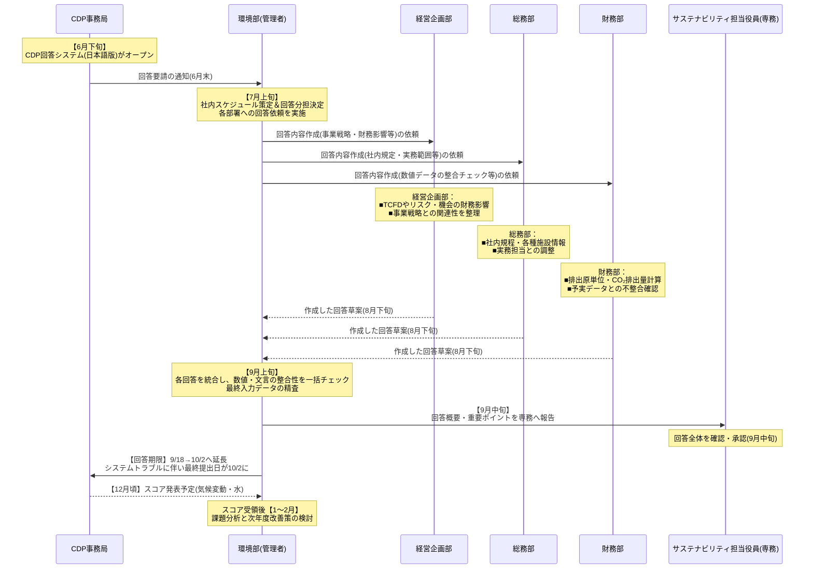

# CDP対応レポート自動化プロジェクト

## プロジェクト基本情報
- プロジェクト名：環境部案件
- 開始日：2025/02/17
- ステータス：新規
- 担当者：AI推進チーム
- プロジェクトリーダー：未定
- 関連部署：環境部
- 保管場所：projects/company_ai_promotion/
projects/environment_department_project/

## プロジェクトのゴール
環境部がCDP（Carbon Disclosure Project）に提出するレポート作成にかかる負荷を軽減するため、生成AIを活用してレポートの自動作成を実現し、全体の業務効率と正確性を向上させる。

## プロジェクト概要
本プロジェクトは、経営品質本部の中村役員から提案のあった「CDP関連レポートを生成AIで作成できないか」という要望を受け、株主総会問答集の作成で培った生成AIの活用ノウハウをもとに、環境部が毎年CDPへ提出するレポート作成プロセスを自動化する取り組みです。  
具体的には、下記のような業務フロー（情報収集→データ分析→レポート作成→内部レビューと提出）を対象に、生成AIによる自動作成または一部支援が可能となる仕組みを検討・実装します。  
この取り組みにより、レポート作成にかかる時間と人的リソースの削減、提出内容の精度向上、スケジュール遵守を目指します。

### 背景
* 経営品質本部の中村役員から、環境部のレポート作成に大きな負荷がかかっていることが指摘された。  
* CDP（Carbon Disclosure Project）は国際的な非営利団体であり、環境関連情報の開示が厳格に求められ、毎年多くの時間とリソースを要する。  
* 株主総会問答集の作成で生成AIを活用した実績があるため、それを応用することが可能と考えられている。  
* スケジュール調整が厳しくなる可能性が高いため、PJメンバー選抜と効率的なヒアリング・資料共有が必要とされている。  

### 課題
1. レポート作成における作業負荷の高さ  
    - CDPの質問数が膨大（回答内容による分岐も含めると200問前後）であり、英語からの直訳や専門用語が多い関係で質問文を正しく理解するだけでも時間がかかる  
    - 毎年少しずつ質問内容やスコアリング基準が変化し、年々ハードルが上がっているため、変更点の確認やスコア獲得のポイントを読み解く作業が必要  
    - 回答にあたっては、環境部主導のCO2削減施策だけでなく、グループ全体の環境活動情報や事業本部サイドの社外への環境貢献、事業戦略、今後の見通しなど多岐にわたる情報を収集・整理しなければならない  
    - 環境リスクや機会の財務影響を定量的に算定するノウハウが乏しく、経営企画部など他部署の協力が必須  
    - エネルギー使用量やCO2排出量を、CDPの回答形式に合った切り分けで再集計する必要があり、かつCSVやExcelファイルのアップロード機能がないため、大量のデータを手入力している  
    - Scope1、Scope2の算定方法など、回答が毎年ほぼ同じ質問についても過去回答がプラットフォームに自動反映されず、毎年転記作業が発生している  
    - コンサルを導入せず、自力で回答を作成しているため、情報収集や回答検討の負荷が大きい  
    - 提出直前には、分担入力している経営企画部や環境部の各部員が集まり、回答内容の整合性を数日かけてチェックしなければならない（数字の一貫性や平仄合わせを含むダブルチェックが必須）  

2. スケジュールの厳しさ  
    - 毎年設定される提出期限（通常は9月中旬～10月上旬ごろ）に合わせるため、限られた期間でレポートを完成させる必要がある  
    - 日本語版のオンライン回答システム（ORS）が例年6月末～7月ごろに公開されるため、そこから提出期限までに全回答を完了し、内部レビューや役員報告を終えなければならない  
    - 関係者の予定が合わず、ヒアリングや業務フロー確認の場を確保しにくい  

3. 生成AI導入への懸念  
    - 機密情報を扱うため、セキュリティや品質を担保した運用体制が必要  
    - 自動生成結果に対する正確性や最終レビュー責任の所在が明確化されていない  

### 要件
1. 生成AIを活用するレポート自動作成機能  
    1. CDP質問書の項目に沿った文章生成が可能であること  
    2. 温室効果ガス排出量など各種定量データを正確に引用・統合できること  
    3. 株主総会問答集のようなQ&A形式の経験を応用し、ガイドラインに沿った出力を行うこと  
2. 既存システムやデータソースとの連携  
    1. CDPオンライン回答システム（ORS）への入力支援  
    2. 社内データベースやドキュメント管理システムと連携して必要情報を抽出できること  
3. セキュリティ・ガバナンス  
    1. 環境部内の機密情報が外部に漏洩しない仕組み  
    2. 生成AI利用時におけるレビュー体制と責任範囲の明確化  

### スプリントゴール
* 最初のスプリントで、実際のCDP質問書に対してAIが生成可能な出力の品質をテストし、必要なデータ連携方法を洗い出す。  
* 2回目以降のスプリントで、レビュー体制を確立し、実際のレポート提出スケジュールに間に合うよう自動化フローを試験導入する。  

### スプリント課題
1. スプリント1  
    1. CDP質問書をもとに試験的なAI応答生成  
    2. データ連携・変換の要件定義  
2. スプリント2  
    1. 生成したレポート出力のレビュー・フィードバック体制構築  
    2. ORSへの入力補助機能とセキュリティ観点の確認  
3. スプリント3  
    1. 実際のCDP提出期限に向けた試験運用  
    2. ボトルネックとなるポイントの洗い出しと最終調整  

### 確認済スケジュール
* 2025年02月下旬: 環境部との初回ヒアリング（業務フロー・ボトルネック確認）  
* 2025年03月: データ連携・システム要件定義の完了  
* 2025年04月: AI生成モデルの調整、レビュー体制構築  
* 2025年05月: 試験運用と改修  
* 2025年06月: CDP質問書の英語版公開（参考用）  
* 2025年07月: CDP日本語版ORS公開（予定）、本格的な回答作成開始  
* 2025年08月下旬: レポート回答の最終入力完了・内部レビュー  
* 2025年09月中旬～10月上旬: 提出期限（CDP側のシステムトラブル等により延長の可能性あり）  
* 2025年10月: フィードバックの収集と改善  

### 関連部署
- 環境部（CO2排出量・各種環境施策の取りまとめおよび全体管理）  
- 経営企画部（気候変動リスク・機会の財務影響試算、将来戦略の取りまとめ）  
- 財務部（排出量取引やコスト面の分析、予算管理）  
- その他関連事業本部（事業活動における環境貢献や温室効果ガス排出量集計）  
- 必要に応じて情報システム部（社内データベース連携やシステム面のサポート）  

### MTGルール
1. ヒアリングやレビューを効率的に進めるための基本ルール  
    - 資料は事前共有し、会議時間を有意義に使う  
    - 会議終了後24時間以内に議事録を共有する  
2. 情報管理・セキュリティルール  
    - 機密情報を含む資料はアクセス権限を制限して保管  
    - AI利用時のデータ取り扱い基準を明確化する  

### ToDo
| ToDoジャンル     | ToDo                                                           | 担当         | 期限          |
|------------------|---------------------------------------------------------------|--------------|---------------|
| ヒアリング調整   | 中村役員に連絡し、環境部とのヒアリング日程を確定する           | PJリーダー   | 2025/02/末    |
| 資料収集         | 環境部が保有する業務フロー資料・ボトルネック整理資料を入手     | PJメンバー   | 2025/03/上旬  |
| AIモデル検討     | 既存の株主総会問答集AIモデルをCDP向けにチューニング可能か調査  | AI担当       | 2025/03/中旬  |
| ORS連携設計      | ORSへの自動入力と出力確認用インタフェースの要件定義            | システム担当 | 2025/04/上旬  |

### 備考
* 資料準備に関する注意点  
    - CDPガイダンスやスコアリング基準など必要資料は事前に共有すると効率的  
    - 環境部の実際の運用フローと差異がある場合は随時修正予定  
    - 下記のような資料も参考資料として共有可能  
      - CDP説明資料（竹島専務や津加専務へのご説明用スライド）  
      - CDP管理者マニュアル（2024.11作成）  
      - CDP2024の当社の実際の回答内容  
* データ管理に関する注意点  
    - 温室効果ガス排出量などの定量データや機密情報の取り扱いは厳重に行う  
    - 生成AI出力の正確性と最終レビューは必ず複数人体制で実施  

## 業務フロー

